# Write-up:
- **Nombre de la máquina:** Trust 
- **Plataforma:** Dockerlabs 
- **IP:** 172.18.0.2 
- **SO:** Linux 
- **Dificultad:** Muy Fácil 

## 1. RECONOCMIENTO 

- Lanzamos ping para comprobar conectividad con máquina víctima.
```
ping 172.18.0.2
``` 
Nos devuelve conectividad y un ttl=64 por lo que deducimos que se trata de un máquina Linux. 

<p align="center">
    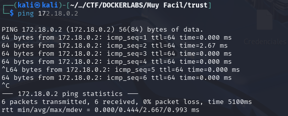
</p>


- Lanzamos un NMAP para ver los puertos abiertos y los servicios y versiones  que corre por ellos.
```
sudo nmap -p- -sV -sC -sS --min-rate 5000 --open -vvv -n -Pn 172.18.0.2  -oN port_scan.txt
```
Nos devuelve 2 puertos abiertos:
	:22. con servicio ssh
	:80 con servicio http

<p align="center">
    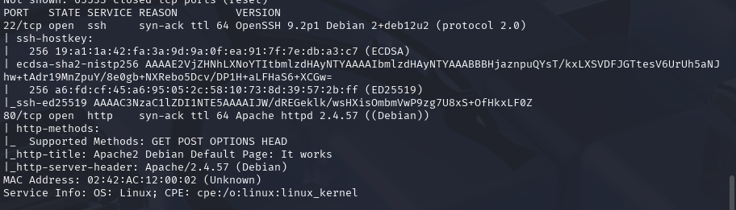
</p>


Normalmente el acceso por el puerto 22 al servicio ssh requiere de credenciales. Ya sea usuario y contraseña o una clave rsa. En este caso carecemos de información al respecto así qu lo más productivo es pasar a explorar el puerto 80

## 2. Enumeración

### Puerto 80 (HTTP) :
Se accede a la web y se encuentra una página por defecto de Apache. 

<p align="center">
    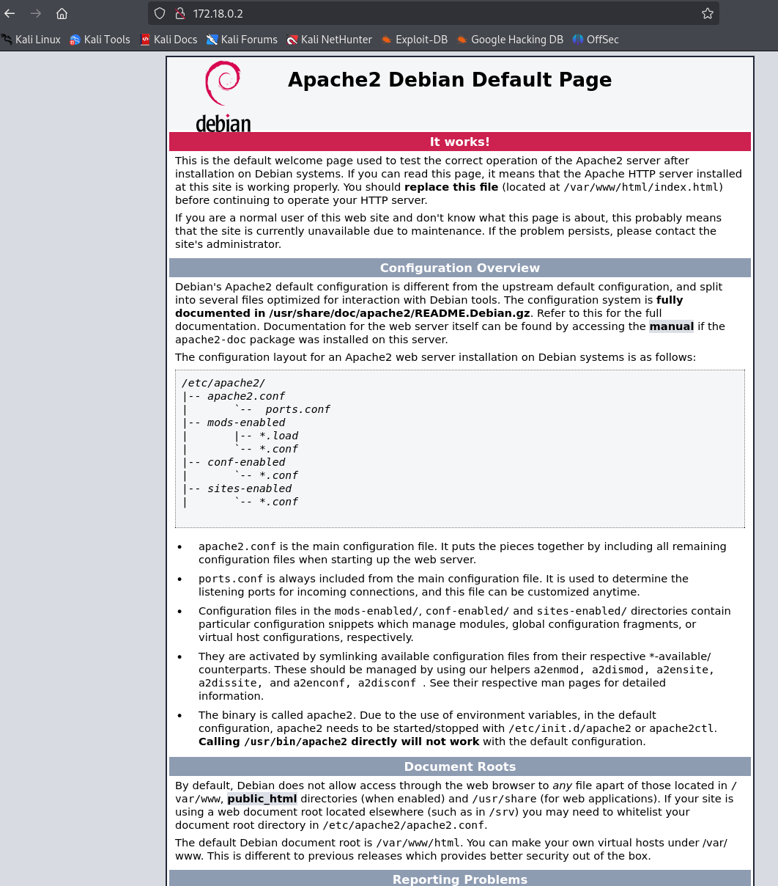
</p>


Actuaremos en dos frentes de la ENUMERACIÓN paralelamente:

#### Enumeración manual:

Buscamos directorios comunes de forma manual:

	- /robots.txt -->X
	- /sitemap.xml--> X
	- /login--> X
	- /admin--> X
	- /panel-->X
	- /user-->X
	- /backup, --> X
	- /uploads, --> X
	- /test--> X

No encontramos nada. 


#### Enumeración automática:
Lazamos la herramienta de enumeración `gobuster` para buscar directorios ocultos y extensiones .php,.txt y .html de forma automática

```
sudo gobuster dir -u http://172.18.0.2/ -w /usr/share/wordlists/dirbuster/directory-list-lowercase-2.3-medium.txt -x txt,php,html  -k
```

Nos devuelve varias rutas, pero hay una llamativa: `/secret.php`

<p align="center">
    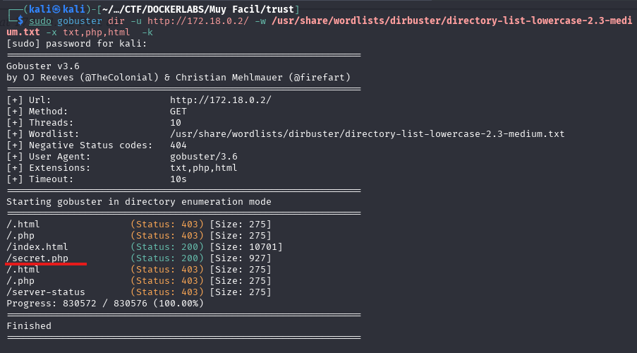
</p>


Estudiamos esta dirección : 172.18.0.2/secret.php 

<p align="center">
    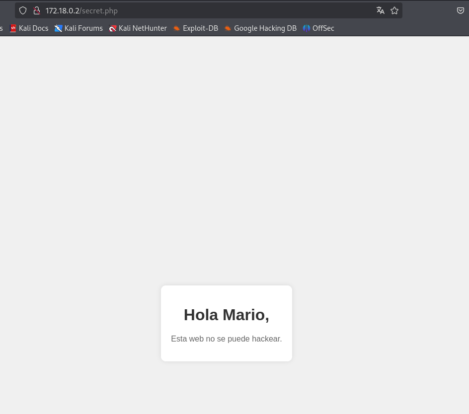
</p>


Tras un vistazo sólo encontramos como hallazgo relevante el posible nombre de un usuario: `Mario` nada más en la página. Tampoco nada escondido en su código fuente.


<p align="center">
    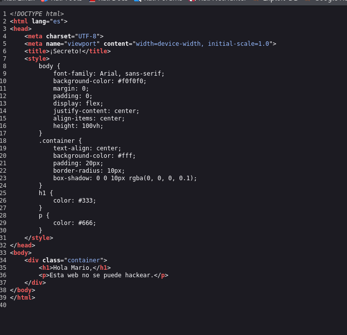
</p>


### Puerto 22(SSH)

Si recordamos para acceder al servicio que corre en el puerto :22, el servicio `ssh` necesitamos algún tipo de credencial. Debemos probar si con este usuario que hemos encontrado `Mario` podemos acceder. 

Para ello utilizaremos la fuerza bruta con la herramienta `Hydra` que probará un diccionario con miles de opciones de contraseña para el usuario que le aportamos. 

```
hydra -t 4 -l mario -P /usr/share/wordlists/rockyou.txt ssh://172.18.0.2
```

Averigua que para el usuario mario la password es `chocolate`
mario:chocolate

<p align="center">
    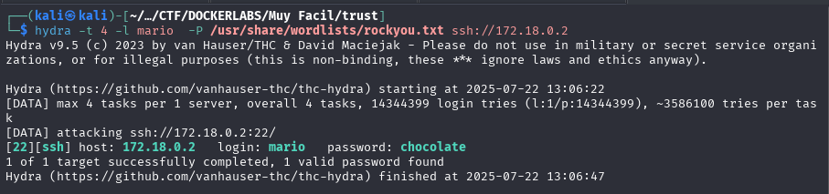
</p>


## 3. Explotación

### 3.1 Acceso inicial:

Con las credenciales descubiertas `mario:chocolate`  nos conectamos al servicio ssh:

```
ssh mario@172.18.0.2
``` 

<p align="center">
    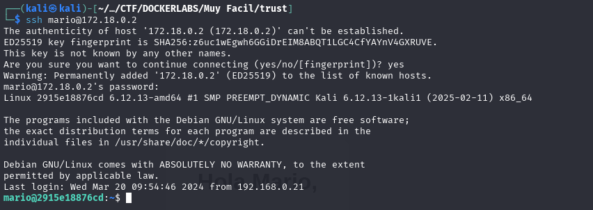
</p>


### 3.2 Enumeración Interna:
Una vez hemos entrado al sistema debemos hacer algunas comprobaciones.
	¿Qué usuario somos?
	¿A qué grupo pertenecemos?
	¿Qué usuarios hay en el sistema?
	
#### 3.2.1 Comprobaciones

¿Quiénes somos?
`whoami`

<p align="center">
    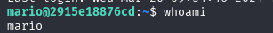
</p>

 
 ¿A qué grupo pertenecemos?
`id`

<p align="center">
    
</p>

¿Qué usuarios hay en el sistema?
`cd /home`
`ls -la`

<p align="center">
    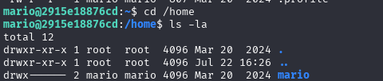
</p>


#### 3.2.2 Búsqueda del Vector de Escalada de privilegios:

Tras las comprobaciones iniciales, el siguinete paso es buscar una forma de elevar nuestros privilegios al usuario root. 

Una de las primeras verificaciones es comprobar qué permisos tiene nuestro usuario `mario` para ejecutar comando con `sudo`:
	```
	sudo -l
	```

En este caso podemos ejecutar como root  el editor de texto `vim` 
<p align="center">
    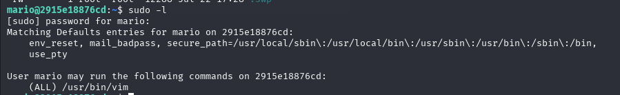
</p>


### 3.3 Explotación y Escalada a Root


Debido a que `vim` es un editor de texto que permite ejecutar comandos de sistema desde si interfaz. Al poder ejecutar `vim` como  `root ` podemos usar esta funcionalidad para lanzar una shell que tendrá privilegios de `root`.

1. Ejecutar `vim` como sudo:
	`sudo vim`
2. Obtener una Shell de Root:
   Un vez dentro de la interfaz de `vim`:
	- primero ejecuta el símbolo `:` Esto hace que aparezca una línea de comando abajo (verás algo como `:` esperando que escribas un comando). 
<p align="center">
    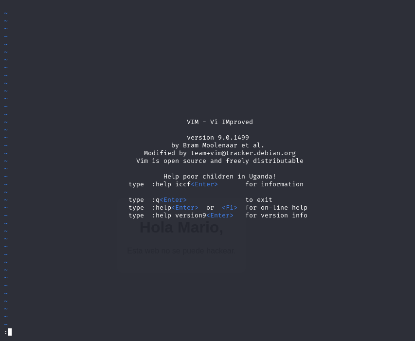
</p>

	- A continuación  ejecuta el comando  `shell`  escribiéndolo y pulsando enter
<p align="center">
    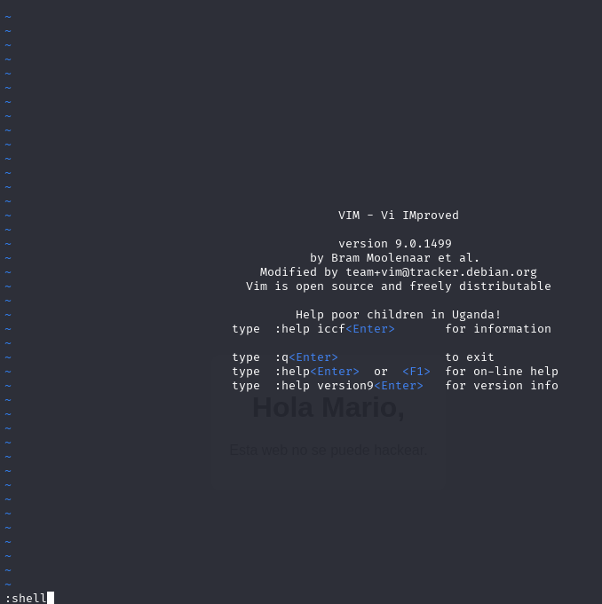
</p>

3. Verificamos la escalada 
	   `whoami`
	Somos root 
<p align="center">
    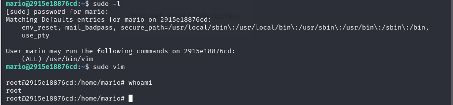
</p>


#### 4. Alternativa Bonus para la escalada de privilegios

Si buscamos en GTFOBINS para el binario `vim` , encontramos un método más rápido para la escalada de privilegios.

- Referencia https://gtfobins.github.io/gtfobins/vim/#sudo

Vemos que no requerimos de entrar al modo interactivo de `vim` . Podemos utilizar un argumento en una linea de comando para ejecutar directamente la elevación de privilegios :

<p align="center">
    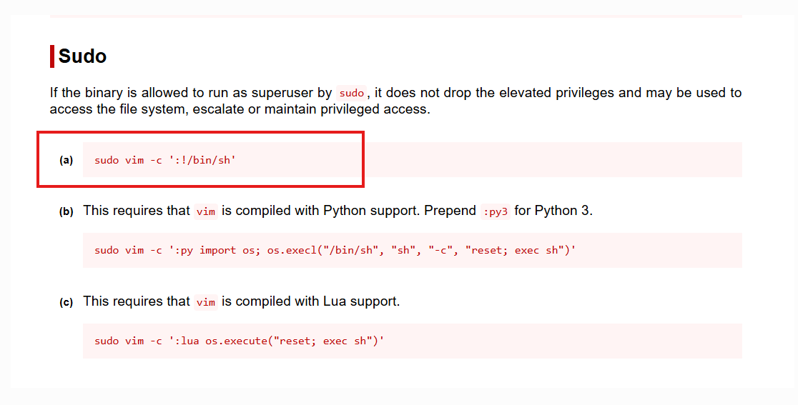
</p>

- Comando:
```
sudo vim -c ':!/bin/sh'
```

Como podemos ver al ejecutarlo nos eleva a usuario `root` .
<p align="center">
    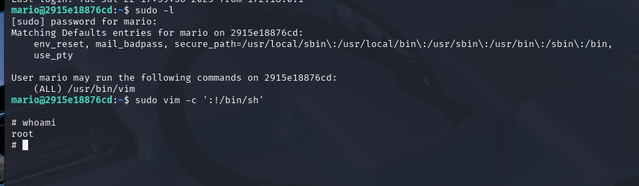
</p>


