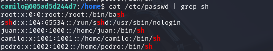
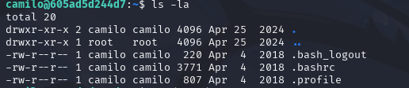
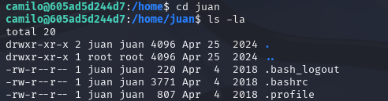
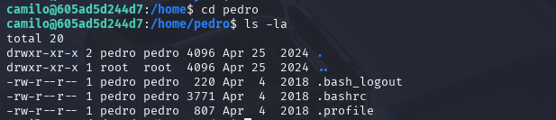
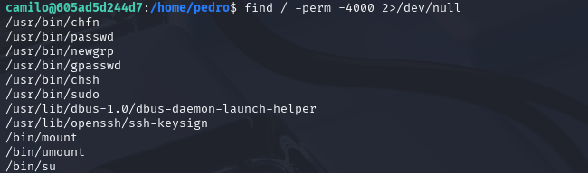
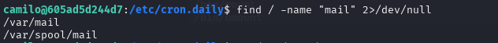
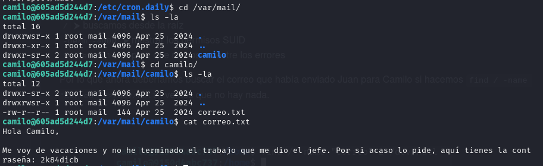
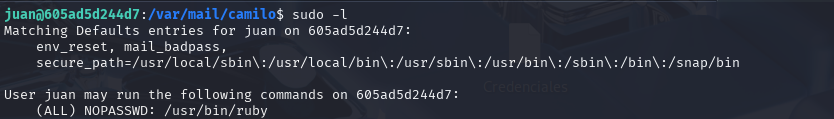
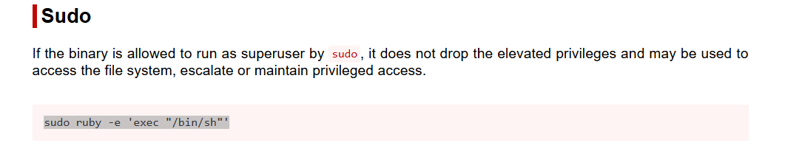
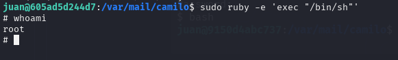

# Write-up: Vacaciones

- **Nombre de la máquina:** `Vacaciones` 
- **Plataforma:** `Dockerlabs` 
- **IP:** `172.17.0.2` 
- **SO:** `Linux` 
- **Dificultad:** `Muy Fácil`

---

## 1. RECONOCIMIENTO

El objetivo de esta fase es identificar los puntos de entrada y servicios expuestos en la máquina víctima.

#### 1.1. Verificación de Conectividad

Se lanza un `ping` para confirmar que la máquina está activa y obtener el TTL lo que puede darnos una primera pista sobre el sistema operativo.
	`ping 172.17.0.2`
Nos devuelve conectividad y un TTL=64 por lo que estamos ante una máquina Linux.


#### 1.2. Escaneo de Puertos

Se realiza un escaneo con **Nmap** para descubrir puertos abiertos, los servicios que corren en ellos y sus versiones.

```
sudo nmap -p- -sV -sC -sS --min-rate 5000 --open -n -Pn 172.17.0.2 -oN port_scan.txt
```

**Puertos Descubiertos:**

| Puerto | Servicio | Versión       | Notas                    |
| ------ | -------- | ------------- | ------------------------ |
| 22     | ssh      | OpenSSH 7.6   | Necesitamos credenciales |
| 80     | http     | Apache 2.4.29 | Iniciaremos por aquí     |
-

Normalmente el acceso por el puerto 22 al servicio ssh requiere de credenciales. Ya sea usuario y contraseña o clave rsa. En este caso carecemos de información al respecto así que lo más productivo es explorar el puerto :80

---

## 2. ENUMERACIÓN

Una vez identificados los servicios, se procede a investigarlos en profundidad en busca de vulnerabilidades o información útil.

### Puerto 80 ( HTTP)

#### Enumeración Manual:

- **Navegación web:** Se visita el sitio en `http://172.17.0.2.
    Tenemos una página en blanco
    
     
- **Análisis del código fuente:** Se revisa el HTML en busca de comentarios, rutas o scripts ocultos.
    Encontramos los nombres de dos posibles usuarios:
	    `Juan` y `Camilo`
	
- **Archivos comunes:** Se buscan manualmente archivos y directorios comunes:
	- `/robots.txt`-->X
	- `/sitemap.xml`--> X
	- `/login`--> X
	- `/admin`--> X
	- `/panel`--> X
	- `/user`--> X
	- `/panel`--> X
	- `backup`--> X
	- `uploads`--> X
	- `test, etc.`--> X
    
    No encontramos nada
#### Enumeración Automática:

Lanzamos la herramienta de enumeración `gobuster` para buscar directorios ocultos y extensiones .php,.txt y .html 

```
gobuster dir -u http://172.17.0.2/ -w /urs/share/wordlists/dirbuster/directory-list-lowercase-2.3-medium.txt -x php,txt,html -k
```

**Hallazgos:**

- Nos devuelve algunas rutas pero nada llamativo

### 22(SSH)

Si recordamos para acceder al servicio que corre en el puerto :22, el servicio `ssh`, necesitamos algún tipo de credencial. Debemos probar si con los usuarios que hemos encontrado `Juan` y `Camilo` podemos acceder. 

Para ello utilizaremos la fuerza bruta con la herramienta `Hydra` que probará un diccionario con miles de opciones de contraseña para el usuario que le aportamos. 

`hydra -t 4 -l camilo -P /usr/share/wordlists/rockyou.txt ssh://172.17.0.2`

Averigua que para el usuario camilo la password es `password1`


**Credenciales obtenidas:**
- **Usuario:** `camilo`
- **Contraseña:** `password1`
---

## 3. EXPLOTACIÓN

### 3.1 Acceso inicial:

Con las credenciales descubiertas `camilo:password1`  nos conectamos al servicio ssh:

	ssh camilo@172.17.0.2
	

### Estabilización de la TTY:
Buscamos una shell que pueda interactuar de forma correcta en la terminal. En este caso generamos una shell pseudo-interactiva, muy simple,  que útil para el alcance de este CTF. 

`script /dev/null -c bash`


---

## 4. ESCALADA DE PRIVILEGIOS

Una vez dentro, el objetivo es elevar los privilegios del usuario actual al de `root`.

### 4.1. Enumeración Interna

Se realizan comprobaciones básicas y se buscan posibles vectores de escalada.

#### Comprobaciones del sistema:

¿Qué usuario somos?
`whoami`

¿A qué grupo pertenezco?
`id`
 
 
 
¿Qué usuario hay en el sistema?
`cd home` y `ls` 


¿Qué usuario tienen una shell asignada?

`cat /etc/passwd | grep sh`



Revisamos los directorios de los usuarios:
Camilo:

 
 
Juan:



Pedro:



Una buena práctica sería revisar los comandos utilizados por los usuarios en el `history`
#### Búsqueda del Vector de Escalada:

- **Permisos Sudo:** ¿Qué comandos podemos ejecutar como otro usuario (o `root`)?
    ```
    sudo -l
    ```
    Con el usuario `camilo` para el que tenemos credenciales no existe ningún comando que pueda ejecutar como `root`
- **Binarios SUID/SGID:** ¿Existen binarios con permisos especiales que puedan ser abusados?
    
    ```
    find / -perm -4000 2>/dev/null
    ```
    No encontramos binarios de los que podamos abusar.
    
    

- **Buscamos el correo del que nos habían hablado en el código fuente del servicio web **
	`find / -name "mail" 2>/dev/null`

	Damos con la ruta donde se haya el correo. 
	
	
	Nos movemos hasta ese punto de la ruta y abrimos el archivo que se encuentra en el directorio de `camilo`, `correo.txt` 
	
	Obtenido las credenciales de otro compañero. 
	`2k84dicb`
- Probamos la contraseña con el usuario `juan` y funciona. 
	
	
	Como vemos no tenemos promt asi que vamos  volver a utilizar el comando que hemos usado anteriormente para pseudo estabilizar la TTY . 
		`script /dev/null -c bash`
		
- Siendo el usuario Juan comprobamos de nuevo los **Permisos Sudo:** ¿Qué comandos podemos ejecutar como otro usuario (o `root`)?
    ```
    sudo -l
	```
	
	Vemos que podemos ejecutar como `sudo` `usr/bin/ruby`


### 4.2. Explotación y Escalada a Root

Se ejecuta la técnica para obtener una shell como `root`.

**Referencia (GTFOBins.):** https://gtfobins.github.io/gtfobins/ruby/#sudo 

**Comando de explotación:**

```
sudo ruby -e 'exec "/bin/sh"'
```

**Verificación:**

```
whoami
```



SOMOS ROOT 🚀


---

