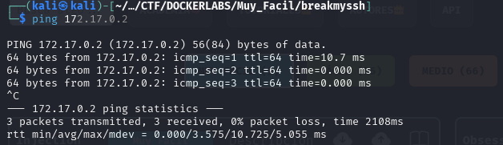
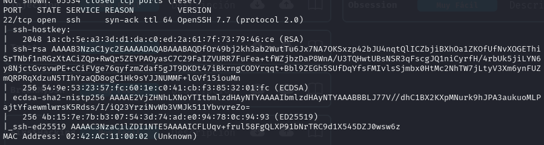
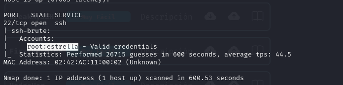
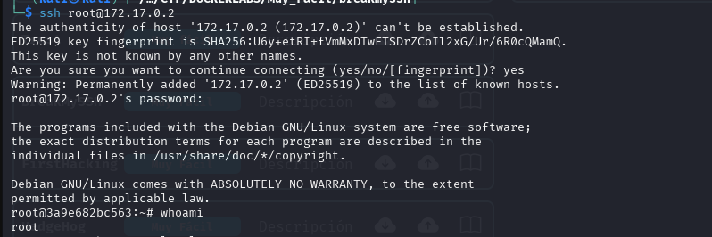

# Write-up: BreakMySSH

- **Nombre de la máquina:** `BreakMySSH` 
- **Plataforma:** `Dockerlabs` 
- **IP:** `172.17.0.2` 
- **SO:** `Linux` 
- **Dificultad:** `Muy Fácil`

-----------------------

## 1. RECONOCIMIENTO

El objetivo de esta fase es identificar los puntos de entrada y servicios expuestos en la máquina víctima.

#### 1.1. Verificación de Conectividad

Se lanza un `ping` para confirmar que la máquina está activa y obtener el TTL lo que puede darnos una primera pista sobre el sistema operativo.
```
ping 172.17.0.2
```
Nos devuelve conectividad y un TTL=64 por lo que estamos ante una máquina Linux.
<p align="center">
    
</p>


#### 1.2. Escaneo de Puertos

Se realiza un escaneo con **Nmap** para descubrir puertos abiertos, los servicios que corren en ellos y sus versiones.

```
sudo nmap -p- -sV -sC -sS --min-rate 5000 --open -n -Pn 172.17.0.2 -oN port_scan.txt
```

**Puertos Descubiertos:**

| Puerto | Servicio | Versión     | Notas |
| ------ | -------- | ----------- | ----- |
| 22     | SSH      | OpenSSH 7.7 |       |


<p align="center">
    
</p>


Normalmente El servicio **SSH (Secure Shell)**, que comúnmente opera en el **puerto 22**, requiere credenciales para permitir el acceso. Los métodos de autenticación habituales son:

- **Usuario y contraseña**.
- **Pares de claves criptográficas** (como RSA o ECDSA).

En este escenario, nos encontramos ante una máquina que solo tiene abierto el puerto 22. Al no haber otros puertos disponibles para explorar, la  vía de acceso potencial es realizar un **ataque de fuerza bruta** contra el servicio SSH para intentar adivinar las credenciales. En caso de que no las encontráramos optaríamos por buscar vulnerabilidades conocidas para la versión de ssh.

## 2. ENUMERACIÓN

Una vez identificados los servicios, se procede a investigarlos en profundidad en busca de vulnerabilidades o información útil.

### 22(SSH)

Si recordamos para acceder al servicio que corre en el puerto :22, el servicio `ssh`, necesitamos algún tipo de credencial. Desconocemos tanto el usuario como la password. 

Por lo que utilizaremos  la herramienta `Nmap` que probará un script de fuerza bruta alojado en nuestro Kali, `ssh-brute.nse ` que hace uso de una `wordlists` diccionario con múltiples opciones de usuario y contraseña. 

```
sudo nmap -p22 --script ssh-brute.nse 172.17.0.2
```  

Averigua las credenciales de usuario para el servicio ssh.

<p align="center">
    
</p>


**Credenciales obtenidas:**
- **Usuario:** `root`
- **Contraseña:** `estrella`


## 3. EXPLOTACIÓN

### 3.1 Acceso inicial :

Con las credenciales descubiertas `root:estrella`  nos conectamos al servicio ssh:

```
	ssh root@172.17.0.2
```
<p align="center">
    
</p>


Como podemos ver, las credenciales ya nos conectan al servicio como el usuario de máximos privilegios en el sistema por lo que no necesitamos elevar privilegios. 
🚀🚀

