# Write-up: BreakMySSH

- **Nombre de la máquina:** `Borazuwarahctf` 
- **Plataforma:** `Dockerlabs` 
- **IP:** `172.17.0.2` 
- **SO:** `Linux` 
- **Dificultad:** `Muy Fácil`


-----------------------

## 1. RECONOCIMIENTO

El objetivo de esta fase es identificar los puntos de entrada y servicios expuestos en la máquina víctima.

#### 1.1. Verificación de Conectividad

Se lanza un `ping` para confirmar que la máquina está activa y obtener el TTL lo que puede darnos una primera pista sobre el sistema operativo.

```
 ping 172.17.0.2
```
Nos devuelve conectividad y un TTL=64 por lo que estamos ante una máquina Linux. 

 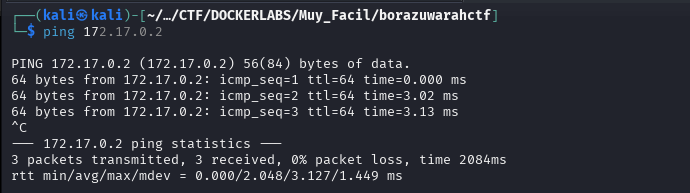

#### 1.2. Escaneo de Puertos

Se realiza un escaneo con **Nmap** para descubrir puertos abiertos, los servicios que corren en ellos y sus versiones.

```
sudo nmap -p- -sV -sC -sS --min-rate 5000 --open -n -Pn 172.17.0.2 -oN port_scan.txt
```

**Puertos Descubiertos:**

| Puerto | Servicio | Versión       | Notas |
| ------ | -------- | ------------- | ----- |
| 22     | SSH      | OpenSSH 7.7   |       |
| 80     | HTTP     | Apache 2.4.59 |       |

/
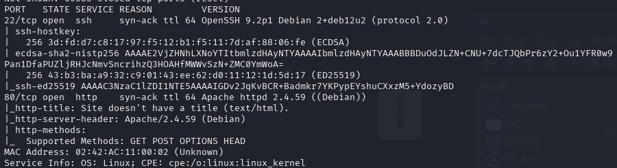

Normalmente El servicio **SSH (Secure Shell)**, que comúnmente opera en el **puerto 22**, requiere credenciales para permitir el acceso. Los métodos de autenticación habituales son:

- **Usuario y contraseña**.
- **Pares de claves criptográficas** (como RSA o ECDSA).

Normalmente el acceso por el puerto 22 al servicio ssh requiere de credenciales. Ya sea usuario y contraseña o clave rsa. En este caso carecemos de información al respecto así que lo más productivo es explorar el puerto :80
## 2. ENUMERACIÓN

Una vez identificados los servicios, se procede a investigarlos en profundidad en busca de vulnerabilidades o información útil.

### Puerto 80 ( HTTP)

#### Enumeración Manual:

- **Navegación web:** Se visita el sitio en `http://172.17.0.2.
    Tenemos una página con un huevo kinder bastante bacano
    
    
- **Análisis del código fuente:** Se revisa el HTML en busca de comentarios, rutas o scripts ocultos.
    No encontramos nada relevante
	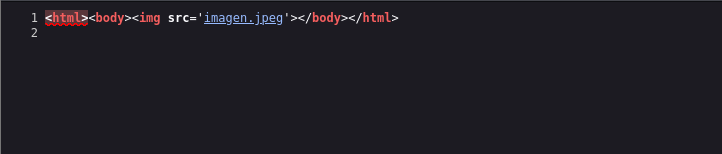
- **Archivos comunes:** Se buscan manualmente archivos y directorios comunes:
	- `/robots.txt`-->X
	- `/sitemap.xml`--> X
	- `/login`--> X
	- `/admin`--> X
	- `/panel`--> X
	- `/user`--> X
	- `/panel`--> X
	- `backup`--> X
	- `uploads`--> X
	- `test, etc.`--> X
    
    No encontramos nada
#### Enumeración Automática:

Lanzamos la herramienta `whatweb` para Identificar las tecnologías del servidor en nuestro caso Apache:
```
whatweb 172.17.0.2
```

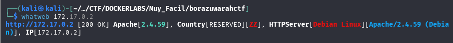


Lanzamos la herramienta de enumeración `gobuster` para buscar directorios ocultos y extensiones .php,.txt y .html 

```
gobuster dir -u http://172.17.0.2/ -w /urs/share/wordlists/dirbuster/directory-list-lowercase-2.3-medium.txt -x php,txt,html -k
```


**Hallazgos:**

- Nos devuelve algunas rutas pero nada llamativo


Tras investigar posibles directivos y  buscar  vulnerabilidades a la versión de Apache sin éxito en metasploit. Nos centramos en lo que tenemos, la imagen del huevo bacano. Descargamos la imagen en el directorio de trabajo. 

 Lanzamos la herramienta de estenografía `exiftools`
```
exiftool imagen.jpeg
```
 
  donde podemos ver en su salida el nombre de un usuario: 
  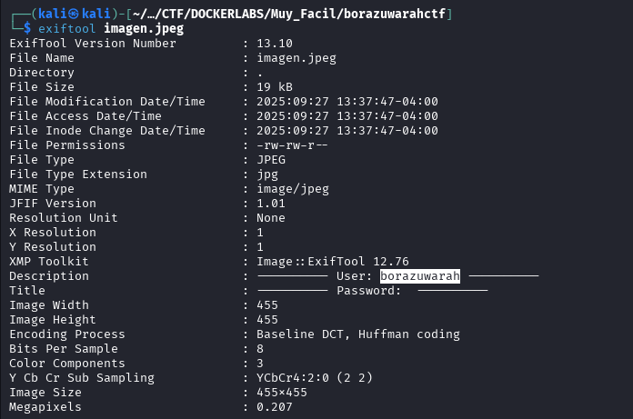
  

Como alternativa a `exiftools` podremos usar `strings`
```
strings Unitled.jpeg
```

 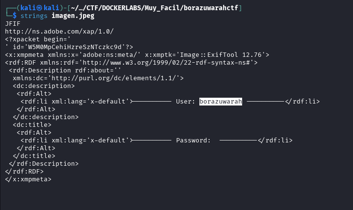


**Hallazgos:**

- Nos devuelve en su output un user: `borazuwarah`


### 22(SSH)

Si recordamos para acceder al servicio que corre en el puerto :22, el servicio `ssh`, necesitamos algún tipo de credencial. Debemos probar si con este usuario que hemos encontrado `borazuwarah` podemos acceder.

Para ello utilizaremos la fuerza bruta con la herramienta `Hydra` que probará un diccionario con miles de opciones de contraseñas para el usuario que le aportamos. 
```
hydra -t 4 -l borazuwarah -P /usr/share/wordlists/rockyou.txt ssh://172.18.0.2
```
Averigua que para el usuario borazuwarah la password es `123456`
borazuwarah:123456

Averigua las credenciales de usuario para el servicio ssh.
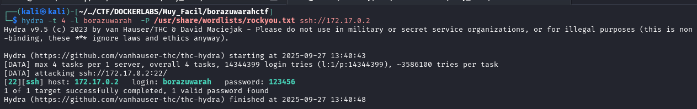
 

**Credenciales obtenidas:**
- **Usuario:** `borazuwarah`
- **Contraseña:** `123456`


## 3. EXPLOTACIÓN

### 3.1 Acceso inicial :

Con las credenciales descubiertas `borazuwarah:123456`  nos conectamos al servicio ssh:
```
	ssh borazuwarah@172.17.0.2
```

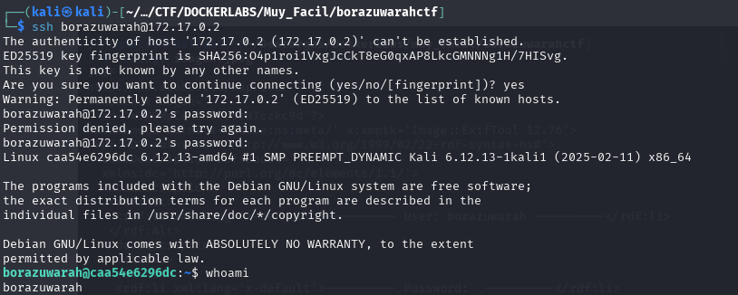


Como podemos ver, las credenciales ya nos conectan al servicio como el usuario borazuwarah.

## 4. ESCALADA DE PRIVILEGIOS

Una vez dentro, el objetivo es elevar los privilegios del usuario actual al de `root`.

### 4.1. Enumeración Interna

Se realizan comprobaciones básicas y se buscan posibles vectores de escalada.

#### Comprobaciones del sistema:

¿Qué usuario somos?
`whoami`

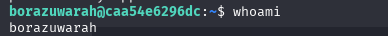

¿A qué grupo pertenezco? `id`

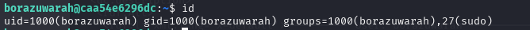
 
¿Qué usuario hay en el sistema?
`cd home` y `ls`
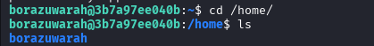
 
 
 ¿Qué usuario tienen una shell asignada?

`cat /etc/passwd | grep sh`

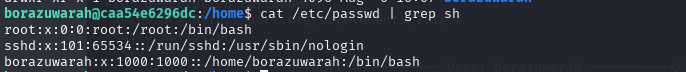


Revisamos los directorios de los usuarios:
borazuwarah: 
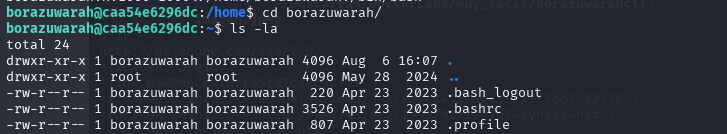


Una buena práctica sería revisar los comandos utilizados por los usuarios en el `history`


#### Búsqueda del Vector de Escalada:

- **Permisos Sudo:** ¿Qué comandos podemos ejecutar como otro usuario (o `root`)?
	```
    sudo -l
	```
    Con el usuario `borazuwarah`  puede ejecutar una shell `/bin/bash` como usuario `root` sin necesidad de contraseña.
    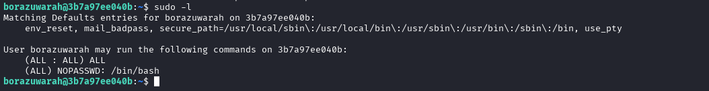
    
    
	Este será el hilo desde el que tirar para escalar privilegios. 
	La mala configuración de `sudoers` nos deja un vector de escalada. 
	
	**Cuando lanzamos el comando sudo -l ** podemos ver que tenemos permisos como el usuario borazuwarah para ejecutar como `root` . Pero quería investigar otras alternativas.
	
	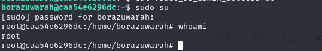
	

- **Binarios SUID/SGID:** ¿Existen binarios con permisos especiales que puedan ser abusados?
    
	 ```
    find / -perm -4000 2>/dev/null
	 ```
    No encontramos binarios de los que podamos abusar.
    
    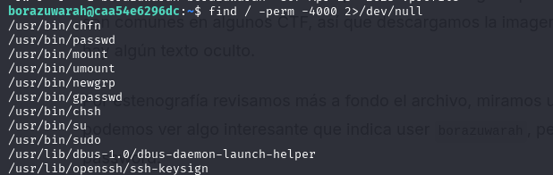
    


****
### 4.2. Explotación y Escalada a Root

Se ejecuta la técnica para obtener una shell como `root`.

Para ello ejecutamos `/bin/bash` a través de `sudo` 
```
sudo /bin/bash
```

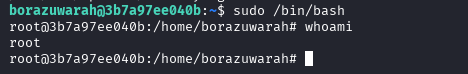


SOMOS ROOT 🚀


