# Write-up:
- **Nombre de la máquina:** Obsession 
- **Plataforma:** Dockerlabs 
- **IP:** 172.18.0.2 
- **SO:** Linux 
- **Dificultad:** Muy Fácil 

## 1. RECONOCMIENTO 

El objetivo de esta fase es identificar los puntos de entrada y servicios expuestos en la máquina víctima. 

#### 1.1 Verificación de Conectividad. 
Se lanza un `ping` para confirmar que la máquina está activa y obtener el TTL lo que puede darnos una primera pista sobre el sistema operativo.

```
 ping 172.17.0.2
```
Nos devuelve conectividad y un TTL=64 por lo que estamos ante una máquina Linux. 

<p align="center">
    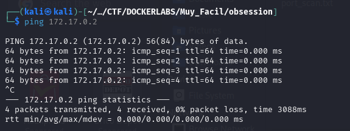
</p>


#### 1.2 Escaneo de Puertos


Lanzamos un NMAP para ver los puertos abiertos, los servicio y versiones que  corre por ellos.
```
sudo nmap -p- -sV -sC -sS --min-rate 5000 --open -vvv -n -Pn 172.18.0.2  -oN port_scan.txt
```

**Puertos Descubiertos**:


| **Puerto** | Servicio | Versión          | Notas                                  |
| ---------- | -------- | ---------------- | -------------------------------------- |
| 21         | FTP      | vsftpd 3.0.5<br> | Protocolo de transferencia de archivos |
| 22         | SSH      | OpenSSH 9.6p1    | Protocolo de conexión remota           |
| 80         | HTTP     | httpd 2.4.58     | Protocolo de servicio web              |


<p align="center">
    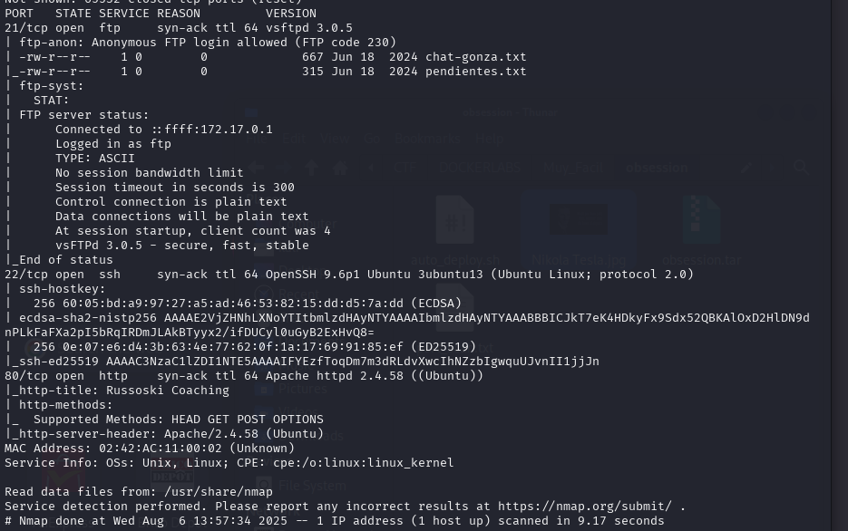
</p>

Para deducir por donde continuaremos en la enumeración; sabemos que para el servicio `ssh` será más efectivo cuando tengamos alguna credencial. Ya sea usuario y contraseña o una clave rsa.
Debemos comprobar si el servicio `FTP` es vulnerable a un inicio de sesión anónimo y si esto no es posible buscaremos elementos para continuar con la explotación en el servicio `http` . 

## 2. Enumeración

Una vez identificados los servicios, se procede a investigarlos en profundidad en busca de vulnerabilidades o información útil.

### 21(FTP)

No existen herramientas propias para enumerar `FTP` por lo que utilizaremos `Nmap` 
```
sudo nmap -p21 --script ftp-anon 172.17.0.2
```

Comprobamos con un script de `Nmap` si tendríamos acceso al servicio con un usuario anónimo. 

<p align="center">
    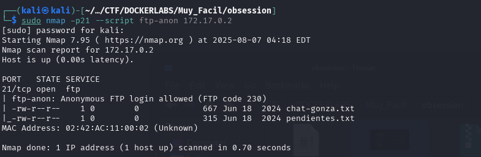
</p>

El servidor `FTP` nos permite el acceso anónimo y 2 archivos en su contenido

Nos conectamos de forma anónima al servidor con las credenciales `anonymous:anonymous`
```
ftp 172.17.0.2
```

<p align="center">
    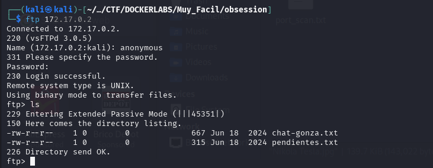
</p>

Descargamos ambos archivos con el comando `get` y lo revisamos con el comando `cat` en nuestro directorio de trabajo. 

<p align="center">
    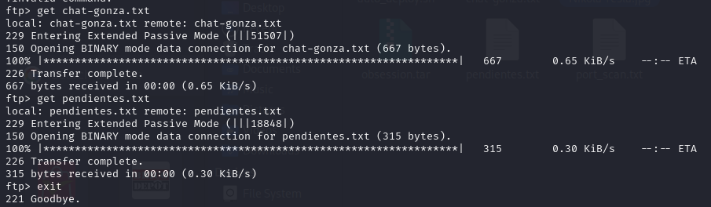
</p>

```
cat chat-gonza.txt
```

<p align="center">
    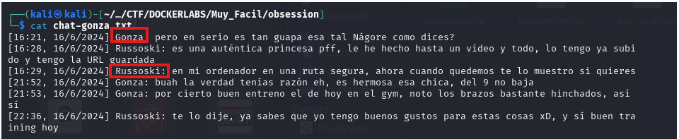
</p>

Encontramos el contenido de un chat entre dos posibles usuarios `Gonza` y `Russoki` con un contenido bastante turbio. 

```
cat pendientes.txt
``` 

<p align="center">
    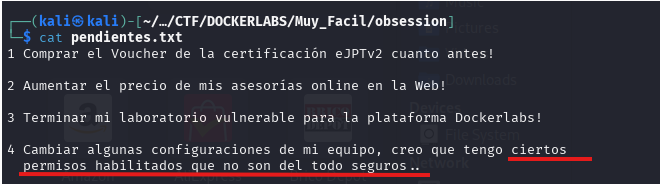
</p>

En su contenido habla sobre que tiene pendiente cambiar permisos poco seguros. 

- **Hallazgos**
	Posibles usuario: `Gonza` y `Russoki`

### Puerto 80 (HTTP) :

Se accede a la web y encontramos una web relacionada con el entrenamiento personal.  

<p align="center">
    
</p>


Accedemos a su código `Click derecho> inspeccionar` 

Donde podemos ver un comentario que nos dice ` Utilizando el mismo usuario para todos mis servicios, podré recordarlo fácilmente` 

<p align="center">
    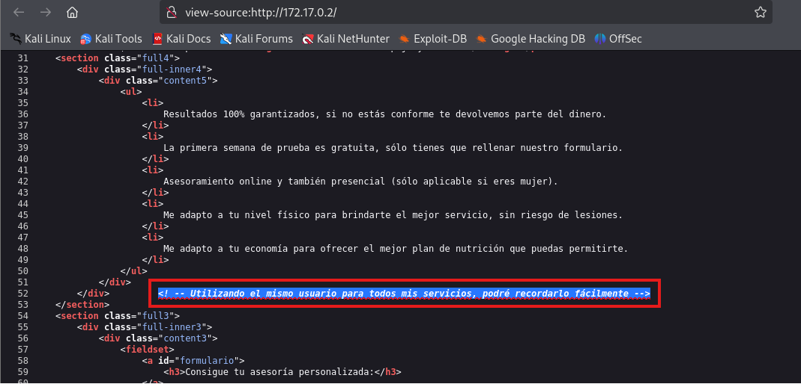
</p>

Actuaremos en dos frentes de la ENUMERACIÓN paralelamente:

#### Enumeración manual:
Buscamos directorios comunes de forma manual:

	/robots.txt -->X
	/sitemap.xml--> X
	/login--> X
	/admin--> X
	/panel-->X
	/user-->X
	 /backup, --> V
	 /uploads, --> X
	 /test--> X

Encontramos un directorio `backup` 

<p align="center">
    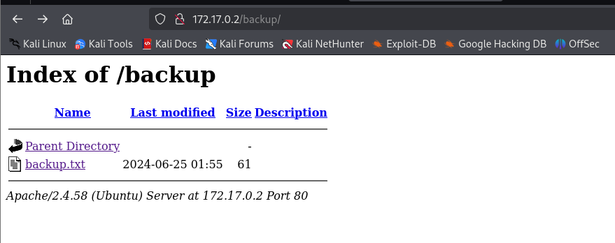
</p>
`backup.txt`: 

<p align="center">
    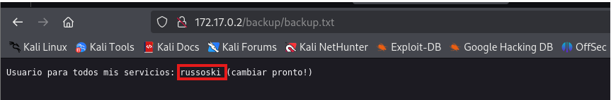
</p>

- Hallazgos:
	En `backup.txt` : confirmamos el usuario `russoski` y además nos dice que es el usuario para todos los servicios. 

#### Enumeración automática:
Lazamos la herramienta de enumeración `gobuster` para buscar directorios ocultos y extensiones .php,.txt y .html de forma automática
```
sudo gobuster dir -u http://172.18.0.2/ -w /usr/share/wordlists/dirbuster/directory-list-lowercase-2.3-medium.txt -x txt,php,html  -k
```

Nos devuelve varias rutas, habiendo descubierto de forma manual ya `/backup` vemos llamativa `/important` 

<p align="center">
    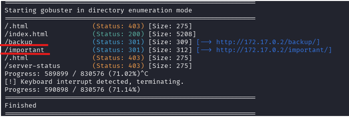
</p>

Estudiamos esta dirección : 172.18.0.2/important 

<p align="center">
    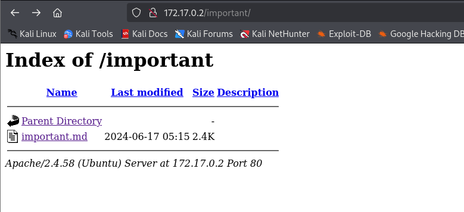
</p>
Accedemos a `important.md`

<p align="center">
    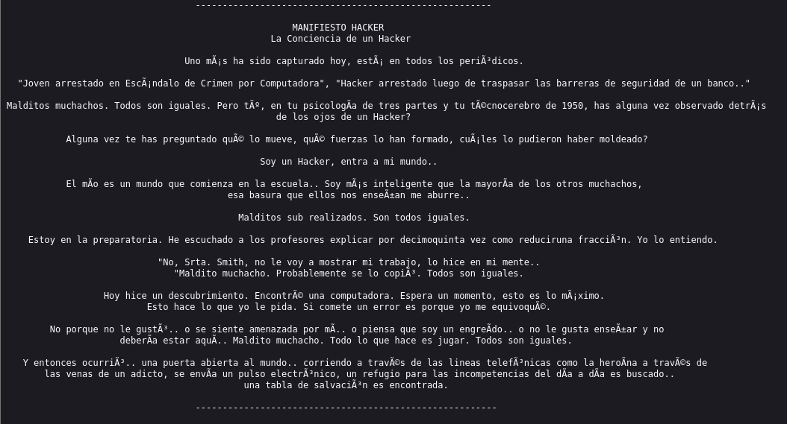
</p>
Manifiesto Hacker. 

### Puerto 22(SSH)

Si recordamos para acceder al servicio que corre en el puerto :22, el servicio `ssh` necesitamos algún tipo de credencial. Debemos probar si con este usuario que hemos encontrado `russoski` podemos acceder. 

Para ello utilizaremos la fuerza bruta con la herramienta `Hydra` que probará un diccionario con miles de opciones de contraseña para el usuario que le aportamos. 
```
hydra -t 4 -l russsoski -P /usr/share/wordlists/rockyou.txt ssh://172.18.0.2
```

Averigua que para el usuario mario la password es `iloveme`
russoski:iloveme

<p align="center">
    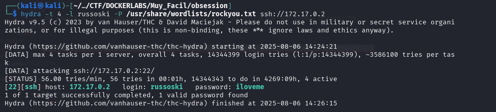
</p>


## 3. Explotación

### 3.1 Acceso inicial:

Con las credenciales descubiertas `mario:chocolate`  nos conectamos al servicio ssh:
```
ssh russoski@172.18.0.2
```

<p align="center">
    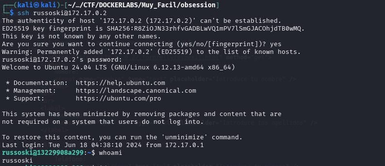
</p>

### 3.2 Enumeración Interna:
Una vez hemos entrado al sistema debemos hacer algunas comprobaciones.
	¿Qué usuario somos?
	¿A qué grupo pertenecemos?
	¿Qué usuarios hay en el sistema?
	
#### 3.2.1 Comprobaciones

¿Quiénes somos? `whoami`

<p align="center">
    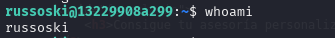
</p>
  
¿A qué grupo pertenecemos? `id`

<p align="center">
    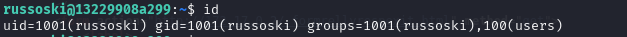
</p>

¿Qué usuarios hay en el sistema?
`cd /home`
`ls -la`

¿Qué usuario tienen una shell asignada?

`cat /etc/passwd | grep sh`

<p align="center">
    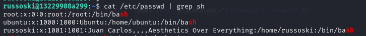
</p>

Revisamos los directorios de los usuarios:
Ubuntu: denegado 

<p align="center">
    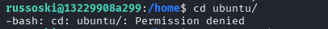
</p>

Russsoski: 

<p align="center">
    
</p>

Podemos ver directorios como `Documentos` y `Proyectos`

- `Documentos` : listamos una foto de Nikola Tesla y la descargamos con el comando `get Nikola Tesla.jpg ` bastante profunda
  
<p align="center">
    
</p>


No vemos nada más relevante 
Una buena práctica sería revisar los comandos utilizados por los usuarios en el `history`


#### 3.2.2 Búsqueda del Vector de Escalada de privilegios:

Tras las comprobaciones iniciales, el siguinete paso es buscar una forma de elevar nuestros privilegios al usuario root. 

Una de las primeras verificaciones es comprobar qué permisos tiene nuestro usuario `russsoski` para ejecutar comando con `sudo`:
```
sudo -l
```

En este caso podemos ejecutar como root  el editor de texto `vim`
<p align="center">
    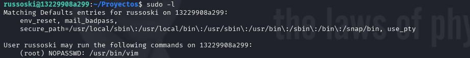
</p>


### 3.3 Explotación y Escalada a Root


Debido a que `vim` es un editor de texto que permite ejecutar comandos de sistema desde si interfaz. Al poder ejecutar `vim` como  `root ` podemos usar esta funcionalidad para lanzar una shell que tendrá privilegios de `root`.

1. Ejecutar `vim` como sudo:
	`sudo vim`
2. Obtener una Shell de Root:
   Un vez dentro de la interfaz de `vim`:

	- primero ejecuta el símbolo `:` Esto hace que aparezca una línea de comando abajo (verás algo como `:` esperando que escribas un comando).

<p align="center">
    
</p>

  -  A continuación  ejecuta el comando  `shell`  escribiéndolo y pulsando enter.
	
<p align="center">
	 
</p>


3. Verificamos la escalada 
	   `whoami`
	   
	Somos root 🚀
<p align="center">
    
</p>

