# Write-up

- **Nombre de la máquina:** `HedgeHog` 
- **Plataforma:** `Dockerlabs` 
- **IP:** `172.17.0.2` 
- **SO:** `Linux` 
- **Dificultad:** `Muy Fácil`

-----------------------

## 1. RECONOCIMIENTO

El objetivo de esta fase es identificar los puntos de entrada y servicios expuestos en la máquina víctima.

#### 1.1. Verificación de Conectividad

Se lanza un `ping` para confirmar que la máquina está activa y obtener el TTL lo que puede darnos una primera pista sobre el sistema operativo.
```
ping 172.17.0.2
```
Nos devuelve conectividad y un TTL=64 por lo que estamos ante una máquina Linux. 
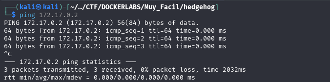

#### 1.2. Escaneo de Puertos

Se realiza un escaneo con **Nmap** para descubrir puertos abiertos, los servicios que corren en ellos y sus versiones.

```
sudo nmap -p- -sV -sC -sS --min-rate 5000 --open -n -Pn 172.17.0.2 -oN port_scan.txt
```

**Puertos Descubiertos:**

| Puertos | Servicios | Versión        | Notas                                                                             |
| ------- | --------- | -------------- | --------------------------------------------------------------------------------- |
| 22      | ssh       | OpenSSH 9.6    | protocolo de red seguro. Acceso remoto                                            |
| 80      | http      | Apache  2.4.58 | Protocolo de comunicación. Transferencia de infromación www.<br>Punto de entrada. |

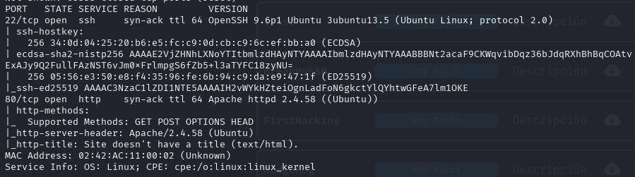

Normalmente el acceso por el puerto 22 al servicio ssh requiere de credenciales. Ya sea usuario y contraseña o clave rsa. En este caso carecemos de información al respecto así que lo más productivo es explorar el puerto :80
## 2. ENUMERACIÓN

Una vez identificados los servicios, se procede a investigarlos en profundidad en busca de vulnerabilidades o información útil.

### Puerto 80 ( HTTP)

#### Enumeración Manual:


- **Navegación web:** Se visita el sitio en `http://172.17.0.2`.
    Tenemos una página con `tails`escrito arriba a la izquierda 
    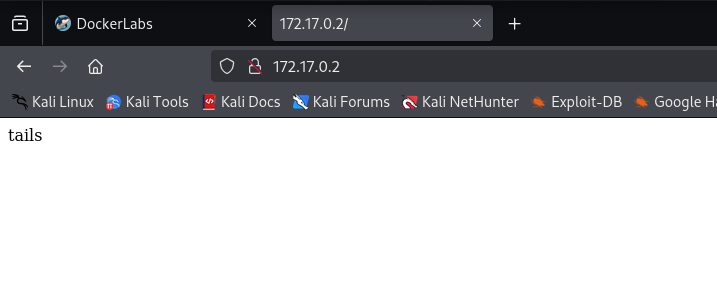

- **Análisis del código fuente:** Se revisa el HTML en busca de comentarios, rutas o scripts ocultos.
    Encontramos el mismo  nombre :
	    `tails`
	    
- **Archivos comunes:** Se buscan manualmente archivos y directorios comunes:
	- `/robots.txt`-->X
	- `/sitemap.xml`--> X
	- `/login`--> X
	- `/admin`--> X
	- `/panel`--> X
	- `/user`--> X
	- `/panel`--> X
	- `backup`--> X
	- `uploads`--> X
	- `test, etc.`--> X
    
    No encontramos nada

#### Enumeración Automática:

- Lanzamos la herrmaienta `whatweb` para que nos de información sobre la aplicación web. 
```
whatweb 172.17.0.2
```
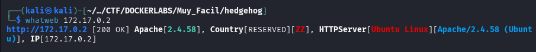

No nos aporta demasiado en este punto
	
- Lanzamos la herramienta de enumeración `gobuster` para buscar directorios ocultos y extensiones .php,.txt y .html 

```
gobuster dir -u http://172.17.0.2/ -w /urs/share/wordlists/dirbuster/directory-list-lowercase-2.3-medium.txt -x php,txt,html -k
```

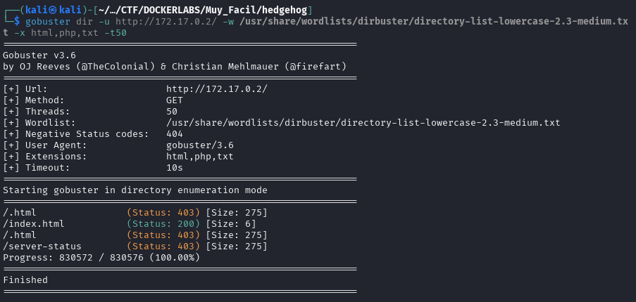

**Hallazgos:**

- Nos devuelve algunas rutas por defecto  pero nada llamativo.

### 22(SSH)

Si recordamos para acceder al servicio que corre en el puerto :22, el servicio `ssh`, necesitamos algún tipo de credencial. Debemos probar si con el posible usuario que hemos encontrado `tails`  podemos acceder. 

Para ello utilizaremos la fuerza bruta con la herramienta `Hydra` que probará un diccionario con miles de opciones de contraseña para el usuario que le aportamos. 
```
hydra -t 4 -l tails -P /usr/share/wordlists/rockyou.txt ssh://172.17.0.2
```

Tras varios minutos vemos que no encuentra la contraseña, algo que para ser un CTF sencillo llama la atención. 

**Análisis fuera de la caja:** `tails` es un comando usado en Linux para mostrar las ultimas líneas de un archivo. Rockyou es un diccionario gigantesco, es posible que la contraseña este al final del archivo y de ahi que se esté demorando tanto. Hacemos algunas pruebas:

- Creamos un diccionario de rockyou que empiece por el final con el comando `tac` que imprime las líneas de un archivo de abajo hacía arriba. :

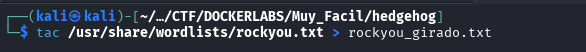

```
	tac /usr/share/wordlists/rockyou.txt > rockyou_girado.txt 
```


- Tras crear el diccionario es importante limpiar las tabulaciones o los espacios que haya en el diccionario. Ten en cuenta que el diccionario esta creado con una estructura  para ser leído de arriba hacía abajo y al voltearlo es probable que los espacio, saltos de linea, etc provoquen que `hydra` no pueda leerlos correctamente. 
	- Por ejemplo: `passwdord\n`-->`␣password

- Para ello editaremos el archivo con `sed` para que sustituya los espacios por nada:
  

```
sed -i 's/ //g' rockyou_girado.txt
```

![[199.10.png]]

- En este punto podemos lanzar `hydra` que probará nuestro diccionario rockyou del revés.
  
```
hydra -t 4 -l tails -P rockyou_girado.txt ssh://172.17.0.2
```

![[199.11.png]]

**Credenciales obtenidas:**
- **Usuario:** `tails`
- **Contraseña:** `3117548331`


## 3. EXPLOTACIÓN

### 3.1 Acceso inicial:

Con las credenciales descubiertas `tails:3117548331`  nos conectamos al servicio ssh:

```
	ssh tails@172.17.0.2
```

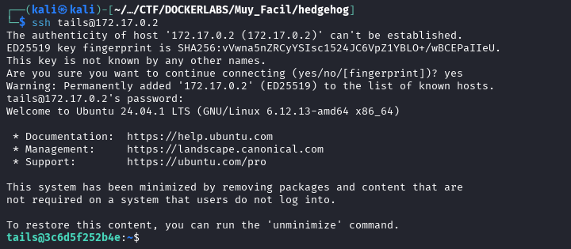
### 3.2 Enumeración Interna:
Una vez hemos entrado al sistema debemos hacer algunas comprobaciones.
	¿Qué usuario somos?
	¿A qué grupo pertenecemos?
	¿Qué usuarios hay en el sistema?
	
#### 3.2.1 Comprobaciones

¿Quiénes somos? `whoami`

 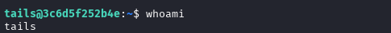
 
 
¿A qué grupo pertenecemos? `id`

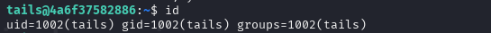

¿Qué usuarios hay en el sistema?
`cd /home`
`ls -la`

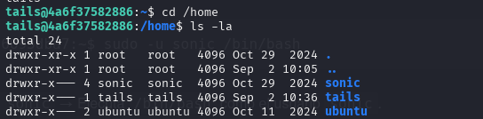

¿Qué usuario tienen una shell asignada?

`cat /etc/passwd | grep sh`

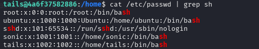

Revisamos los directorios de los usuarios:
`Sonic`: denegado 

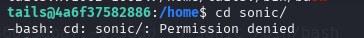

`ubuntu`: denegado 
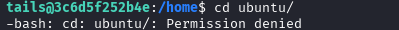

`tails`:

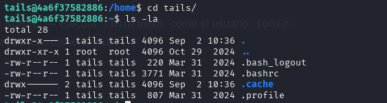


Podemos ver directorios como `.cache` que no veo que tenga mucho valor tras explorarlo. 

Una buena práctica sería revisar los comandos utilizados por los usuarios en el `history`


#### 3.2.2 Búsqueda del Vector de Escalada de privilegios:

Tras las comprobaciones iniciales, el siguinete paso es buscar una forma de elevar nuestros privilegios al usuario root. 

Una de las primeras verificaciones es comprobar qué permisos tiene nuestro usuario `tails` para ejecutar comando con `sudo`:
```
sudo -l
```

En este caso podemos ejecutar cualquier comando como `sonic` sin necesitar contraseña. 
 
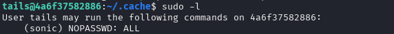


#### 3.2.3 Pivotar al usuario `sonic`

Pivotamos al usuario `sonic` para buscar formas de escalar privilegios

```
sudo -u sonic /bin/bash
```

```
sudo -l
```

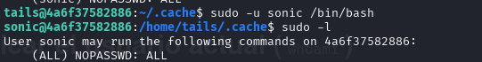
La salida nos dice que podemos ejecutar sin contraseña comandos como `root`. 
### 3.3 Explotación y Escalada a Root


Descubrimos como vector de escalada que el usuario `Sonic`puede ejecutar comandos como `root` sin contraseña así que nos movemos a `root` verificamos la escalada y ...

```
sudo su 
whoami
```


   
	Somos root 🚀

