# Write-up: 

- **Nombre de la máquina:** `PequenasMentirosas` 
- **Plataforma:** `Dockerlabs` 
- **IP:** `172.17.0.2` 
- **SO:** `Linux` 
- **Dificultad:** `Muy Fácil`

---

## 1. RECONOCIMIENTO

El objetivo de esta fase es identificar los puntos de entrada y servicios expuestos en la máquina víctima.

#### 1.1. Verificación de Conectividad

Se lanza un `ping` para confirmar que la máquina está activa y obtener el TTL lo que puede darnos una primera pista sobre el sistema operativo.
	`ping 172.17.0.2`
Nos devuelve conectividad y un TTL=64 por lo que estamos ante una máquina Linux.

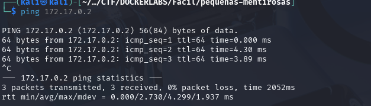 
#### 1.2. Escaneo de Puertos

Se realiza un escaneo con **Nmap** para descubrir puertos abiertos, los servicios que corren en ellos y sus versiones.

```
sudo nmap -p- -sV -sC -sS --min-rate 5000 --open -n -Pn 172.17.0.2 -oN port_scan.txt
```

**Puertos Descubiertos:**

| Puerto | Servicio | Versión       | Notas                    |
| ------ | -------- | ------------- | ------------------------ |
| 22     | ssh      | OpenSSH 9.6   | Necesitamos credenciales |
| 80     | http     | Apache 2.4.58 | Iniciaremos por aquí     |

/
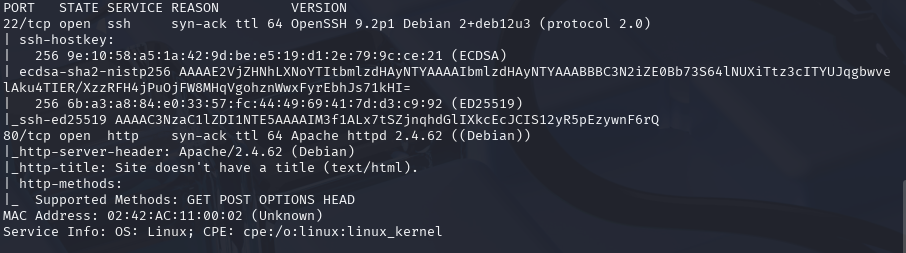

Normalmente el acceso por el puerto 22 al servicio ssh requiere de credenciales. Ya sea usuario y contraseña o clave rsa. En este caso carecemos de información al respecto así que lo más productivo es explorar el puerto :80

---

## 2. ENUMERACIÓN

Una vez identificados los servicios, se procede a investigarlos en profundidad en busca de vulnerabilidades o información útil.

### Puerto 80 ( HTTP)

#### Enumeración Manual:

- **Navegación web:** Se visita el sitio en `http://172.17.0.2.
    Vemos una frase : "==Pista==: Encuentra la clave para A en los archivos"!
    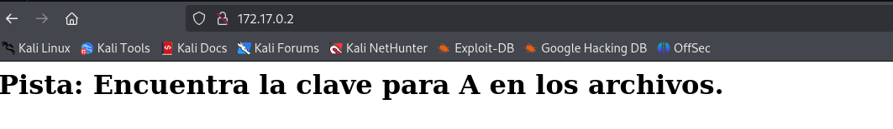
- **Análisis del código fuente:** Se revisa el HTML en busca de comentarios, rutas o scripts ocultos.
    No encontramos nada relevante
	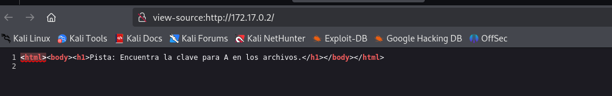
- **Archivos comunes:** Se buscan manualmente archivos y directorios comunes:
	- `/robots.txt`-->X
	- `/sitemap.xml`--> X
	- `/login`--> X
	- `/admin`--> X
	- `/panel`--> X
	- `/user`--> X
	- `/panel`--> X
	- `backup`--> X
	- `uploads`--> X
	- `test, etc.`--> X
    
    No encontramos nada
#### Enumeración Automática:
- Lanzamos la herrmaienta `whatweb` para que nos de información sobre la aplicación web. 
	`whatweb 172.17.0.2` 
	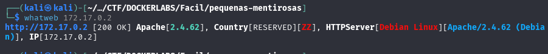
	No nos aporta demasiado en este punto


- Lanzamos la herramienta de enumeración `gobuster` para buscar directorios ocultos y extensiones .php,.txt y .html 

```
gobuster dir -u http://172.17.0.2/ -w /urs/share/wordlists/dirbuster/directory-list-lowercase-2.3-medium.txt -x php,txt,html -k
```

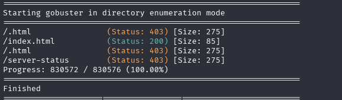
**Hallazgos:**
No vemos ninguna ruta llamativa.

### 22(SSH)

Si recordamos para acceder al servicio que corre en el puerto :22, el servicio `ssh`, necesitamso algún tipo de credencial. Hasta ahora la única pista ha sido la frase: 
**"Pista: Encuentra la clave para A en los archivos"**
Probaremos "a" como usuario en un ataque te fuerza buta al servicio `ssh` con la herramienta `hydra`

`hydra -t 4 -l a  -P /usr/share/wordlists/rockyou.txt ssh://172.17.0.2`


Averigua que para el usuario a la password es `secret`

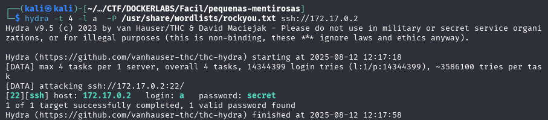

**Credenciales obtenidas:**
- **Usuario:** `a`
- **Contraseña:** `secret`
---

## 3. EXPLOTACIÓN

### 3.1 Acceso inicial:

Con las credenciales descubiertas con `hydra`  nos conectamos al servicio ssh:

	`ssh a@172.17.0.2`

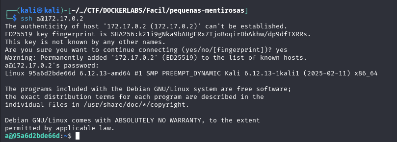


---

## 4. ESCALADA DE PRIVILEGIOS

Una vez dentro, el objetivo es elevar los privilegios del usuario actual al de `root`.

### 4.1. Enumeración Interna

Se realizan comprobaciones básicas y se buscan posibles vectores de escalada.

#### Comprobaciones del sistema:

¿Qué usuario somos?
`whoami`

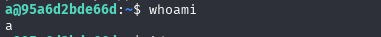
¿A qué grupo pertenezco?
`id`

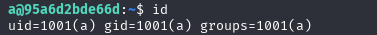
¿Qué usuario hay en el sistema?
¿Qué usuario tienen una shell asignada?

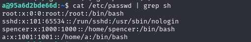

Revisamos los directorios de los usuarios:
`a`:

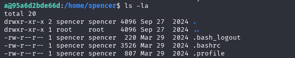
`spencer`:


Desde este punto no tenemos acceso a rotar de usuario ni a buscar sudoers mal configurados o SUID  sin tener credenciales. Por lo que optamos por hacer un ataque con `Hydra` con el usuario nuevo que hemos encontrado `spencer` 

`hydra -t 4 -l spencer  -P /usr/share/wordlists/rockyou.txt ssh://172.17.0.2`

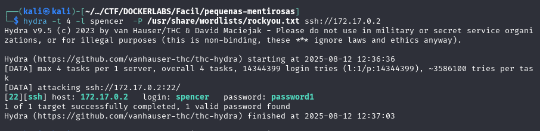
**Credenciales obtenidas:**
- **Usuario:** `spencer`
- **Contraseña:** `password1`

Con las credenciales descubiertas con `hydra`  nos conectamos al servicio ssh:

	`ssh spencer@172.17.0.2`

#### Búsqueda del Vector de Escalada:

- **Permisos Sudo:** ¿Qué comandos podemos ejecutar como otro usuario (o `root`)?
    ```
    sudo -l
    ```
     vemos que el usuario `spencer` tiene permisos para ejecutar `python` como `root`. 
    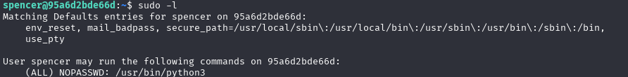
	Hacemos una búsqueda en Gtfobins:
	https://gtfobins.github.io/gtfobins/python/#sudo

	Y encontramos un código para elevarnos a `root`
```
	sudo /usr/bin/python3  -c 'import os; os.system("/bin/sh")'

```


### 4.2. Explotación y Escalada a Root

Se ejecuta la técnica para obtener una shell como `root`.

Ejecutamos el código y... 

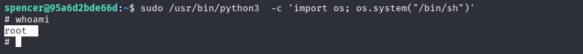

SOMOS ROOT🚀


