# Write-up:

- **Nombre de la máquina:** `Reflection`
- **Plataforma:** `Dockerlabs`
- **IP:** `172.17.0.2`
- **SO:** `Linux`
- **Dificultad:** `Fácil`

---

## 1. RECONOCIMIENTO 🔍

El objetivo de esta fase es identificar los puntos de entrada y servicios expuestos en la máquina víctima.

#### 1.1. Verificación de Conectividad

Se lanza un `ping` para confirmar que la máquina está activa y obtener el TTL, lo que nos da una primera pista sobre el sistema operativo.

```
ping 172.17.0.2
```

Nos devuelve conectividad y un **TTL=64**, lo que confirma que estamos ante una máquina **Linux**.

<p align="center">
    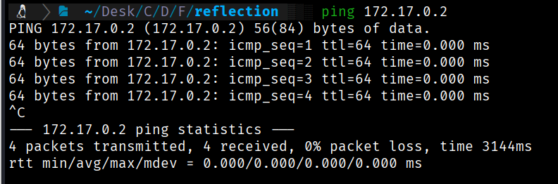
</p>

#### 1.2. Escaneo de Puertos

Se realiza un escaneo con **Nmap** para descubrir puertos abiertos, los servicios que corren en ellos y sus versiones.

```
sudo nmap -p- -sV -sC -sS --min-rate 5000 --open -n -Pn 172.17.0.2 -oN port_scan.txt
```

**Puertos Descubiertos:**

|**Puerto**|**Servicio**|**Versión**|**Notas**|
|---|---|---|---|
|22|ssh|OpenSSH 9.2|Necesitamos credenciales|
|80|http|Apache 2.4.62|Iniciaremos por aquí|

<p align="center">
    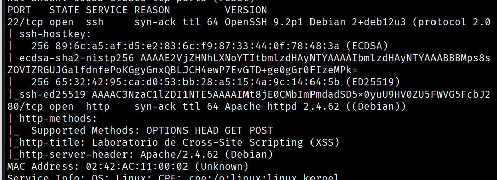
</p>

El acceso por el puerto **22 (ssh)** requiere de credenciales, así que lo más productivo es explorar el servicio **HTTP** en el puerto **80**.

---

## 2. ENUMERACIÓN 

Una vez identificados los servicios, procedemos a investigarlos en profundidad en busca de vulnerabilidades o información útil.

### Puerto 80 (HTTP)

#### Enumeración Manual:

- **Navegación web:** Al visitar `http://172.17.0.2`, encontramos un _hub_ con **4 pequeñas pruebas de XSS (Cross-Site Scripting)**. 
    <p align="center">
    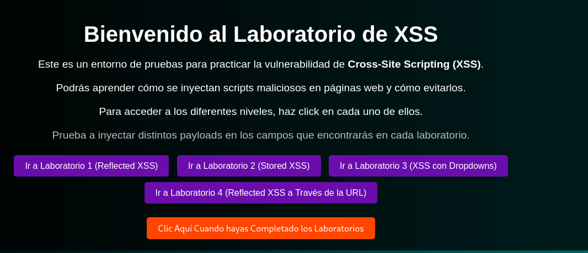
	</p>

**1. Laboratorio Reflejado (Reflected XSS - Input Box):**

Se introduce el _payload_ en la caja de texto para forzar la ejecución del script.

HTML

```

```

El navegador intenta cargar una imagen inválida (`src=x`), lo cual activa el evento **`onerror`**. Esto fuerza la ejecución del código JavaScript, que muestra la ventana emergente (`alert`), confirmando el éxito del ataque de XSS reflejado.
<p align="center">
    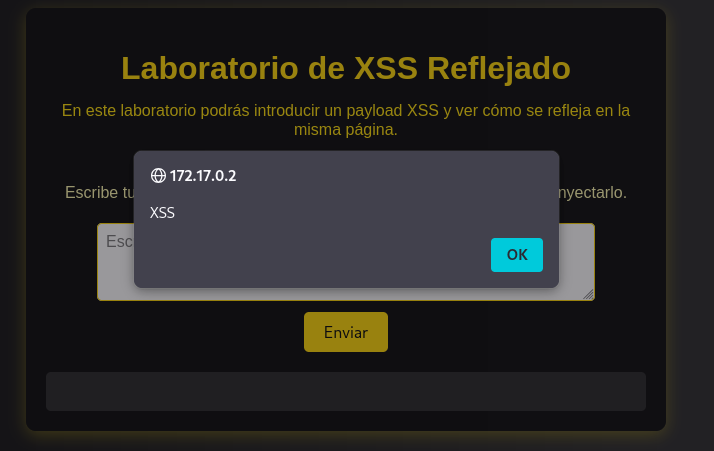
</p>
<p align="center">
    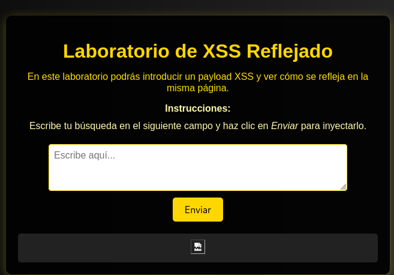
</p>

**2. Laboratorio Almacenado (Stored XSS):**

Se introduce el mismo _payload_.

HTML

```

```

En este caso, el _payload_ malicioso se ha guardado en la aplicación y se ejecutará automáticamente en el navegador de **cualquier usuario** que visite la página que muestre ese contenido almacenado, sin necesidad de interacción adicional.


<p align="center">
    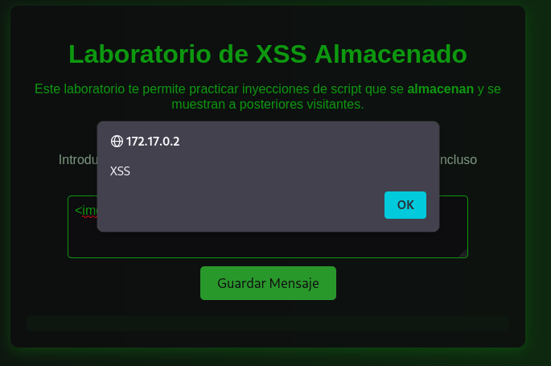
</p>
<p align="center">
    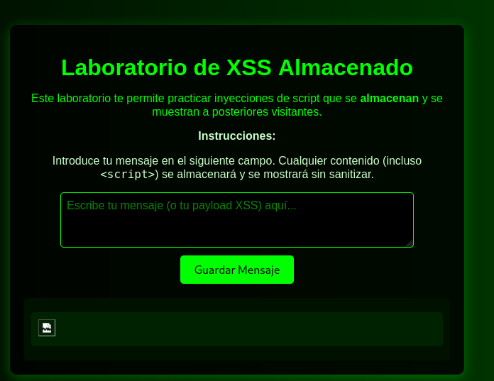
</p>

**3. Laboratorio con Dropdown :**

Observamos que al seleccionar una opción y enviar, el valor se refleja en la **URL**. Sustituimos el valor de la opción en la URL por nuestro _payload_. 
```
 
```

**URL Original** 
<p align="center">
    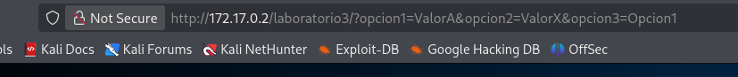
</p>

**URL Modificada con Payload:**
<p align="center">
    
</p>

Vemos cómo el valor del campo pasa a reflejar y ejecutar el _script_.
<p align="center">
    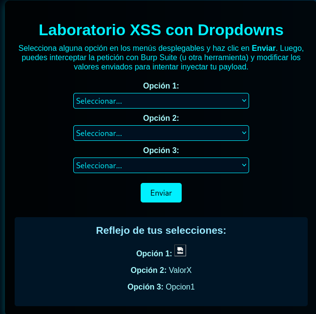
</p>


**4. Laboratorio Reflected XSS a través de URL**

Notamos que la página está esperando un parámetro. Añadimos directamente el parámetro `data` en la URL.
<p align="center">
    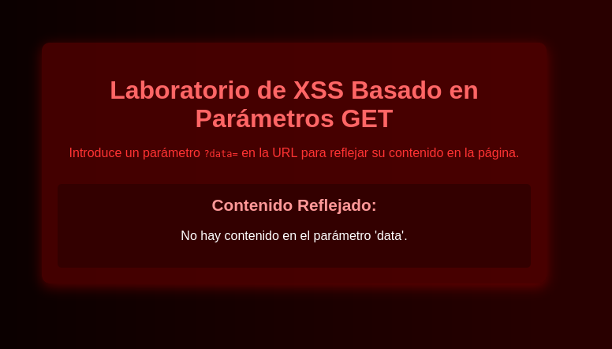
</p>

**URL original** 
<p align="center">
    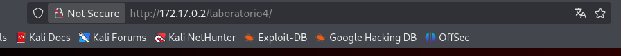
</p>

**URL Modificada con Payload:** `http://172.17.0.2/reflected_url?data=`
<p align="center">
    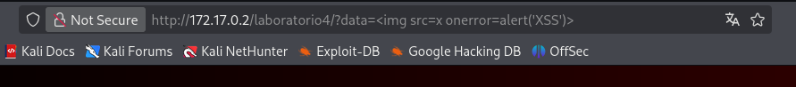
</p>
La inyección es exitosa.
<p align="center">
    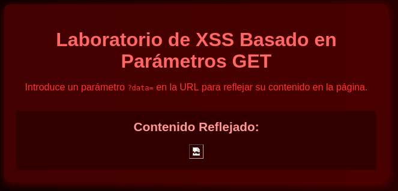
</p>

---

## 3. EXPLOTACIÓN 

Al completar los cuatro laboratorios de XSS, se nos proporciona un _alert_ con las **credenciales SSH** necesarias para el siguiente paso.

<p align="center">
    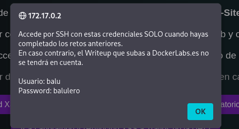
</p>

**Credenciales obtenidas:**
- **Usuario:** `balu`
- **Contraseña:** `baurero`


### 3.1. Acceso Inicial (SSH)

Utilizamos las credenciales descubiertas para conectarnos al servicio **ssh** en el puerto 22.

```
ssh balu@172.17.0.2
```

<p align="center">
    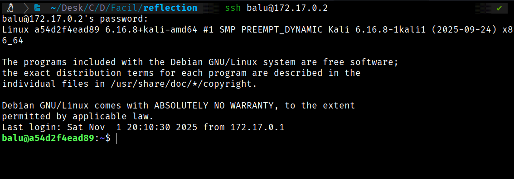
</p>

---

## 4. ESCALADA DE PRIVILEGIOS ⏫

Una vez dentro, el objetivo es elevar los privilegios del usuario actual (`balu`) al de `root`.

### 4.1. Enumeración Interna

Se realizan comprobaciones básicas en busca de posibles vectores de escalada.
#### Comprobaciones del sistema:

¿Qué usuario somos?
`whoami`
<p align="center">
    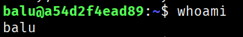
</p>


¿Qué usuario hay en el sistema con una shell?
```
cat /etc/passwd | grep sh
```
<p align="center">
    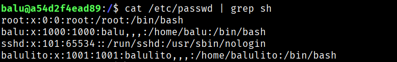
</p>

#### Búsqueda del Vector de Escalada:

Revisamos los binarios con el **SUID** (Set User ID) establecido, que permiten a un usuario ejecutar un archivo con los permisos del propietario (en este caso, `root`).

```
find / -perm -4000 2>/dev/null
```

Entre los resultados, identificamos que el usuario `balu` puede ejecutar el binario **`/usr/bin/env`** como _root_ debido al permiso SUID.

>  <p align="center">
    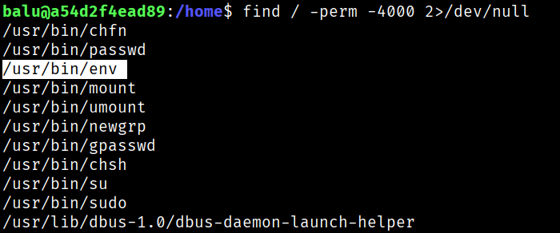
</p>

Buscamos en **Gtfobins** la técnica de escalada de privilegios para el binario `env` cuando tiene el _flag_ SUID.

**Referencia:** https://gtfobins.github.io/gtfobins/env/#suid


### 4.2. Explotación y Escalada a Root

Ejecutamos el comando encontrado para obtener una _shell_ con privilegios de **root**.

```
/usr/bin/env /bin/sh -p
```


<p align="center">
    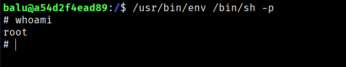
</p>

Somos  Root 🚀
